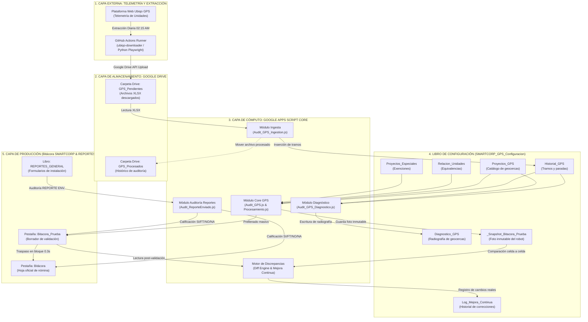
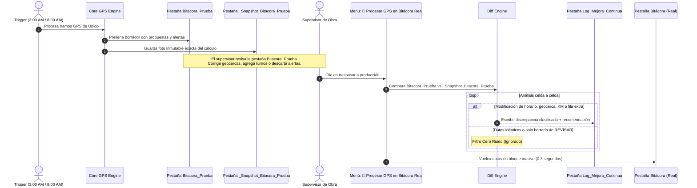
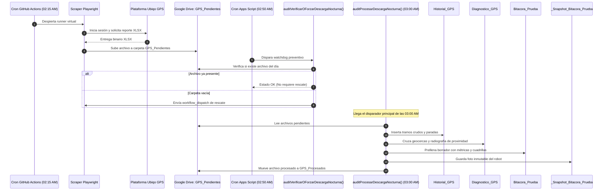
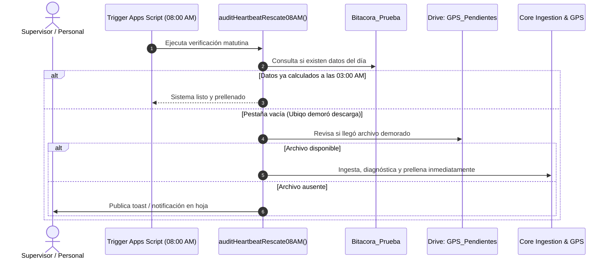
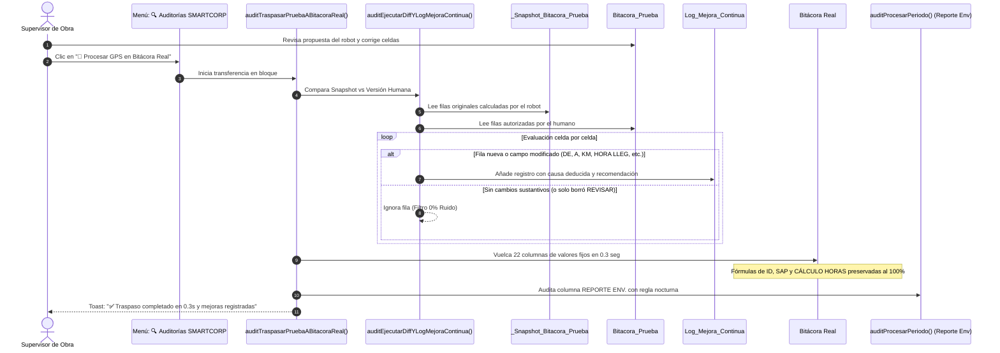

# 📋 Manual Técnico y Arquitectura de Sistemas — Auditorías SMARTCORP
*Versión 3.0 — 25 Septiembre 2026 — Documento Técnico Maestro*

| Metadato Técnico | Detalle de Ingeniería |
| :--- | :--- |
| **Sistema** | Plataforma Automatizada de Auditorías GPS, Telemetría y Validación de Reportes |
| **Versión** | **3.0.0** (Producción Automática, Rescate, Diff Engine & Mejora Continua) |
| **Fecha de Emisión** | 25 de Septiembre de 2026 |
| **Autoría** | Equipo de Automatización, Inteligencia Artificial e Infraestructura SMARTCORP |
| **ID Apps Script** | `1p0-K6cZxNFGoM4m_MMpBTx-MxFKUKWQ75hKxqfLucQuQCTQZnH1UV2t4` |
| **ID Hoja Bitácora** | `18GFvQZdpmALvmmTFc70dXENJxImMR3bkHU04IG_UyyY` |
| **ID Hoja Reportes** | `14vPIvvrc2Cag61_BCdXJd4Cd-yksfV1RqmzMhKesqao` |
| **Clasificación** | Confidencial / Documento Técnico de Arquitectura e Implementación |

---

## 📚 Tabla de Contenidos

1. [Introducción y Filosofía Arquitectural](#1-introducción-y-filosofía-arquitectural)
2. [Arquitectura General y Topología de Red](#2-arquitectura-general-y-topología-de-red)
3. [Descripción y Esquemas de Datos de Hojas de Cálculo](#3-descripción-y-esquemas-de-datos-de-hojas-de-cálculo)
   - 3.1 Libro de Configuración y Telemetría: `SMARTCORP_GPS_Configuracion`
   - 3.2 Libro Maestro de Producción: `Bitácora SMARTCORP`
   - 3.3 Libro de Formularios de Campo: `REPORTES_GENERAL`
4. [Pipeline de Ingesta, Procesamiento y Traspaso End-to-End](#4-pipeline-de-ingesta-procesamiento-y-traspaso-end-to-end)
   - 4.1 Ingesta XLSX a `Historial_GPS`
   - 4.2 Radiografía y Geocercas en `Diagnostico_GPS`
   - 4.3 Prellenado Inteligente en `Bitacora_Prueba`
   - 4.4 Captura Inmutable de Foto (`_Snapshot_Bitacora_Prueba`)
   - 4.5 Traspaso Masivo Ultra-Rápido a `Bitácora Real` (0.3 seg)
5. [Módulo de Auditoría de Reportes Enviados (`REPORTE ENV.`)](#5-módulo-de-auditoría-de-reportes-enviados-reporte-env)
   - 5.1 Algoritmo Triclave de Coincidencia
   - 5.2 Clasificación de Estados (`SI`, `FT`, `NO`, `NA`)
   - 5.3 Regla de Tolerancia Nocturna (`Día + 1`)
6. [Motor de Mejora Continua y Aprendizaje Autónomo (Diff Engine)](#6-motor-de-mejora-continua-y-aprendizaje-autónomo-diff-engine)
   - 6.1 Filosofía de Cero Ruido (Filtrado del 80% de Falsos Positivos)
   - 6.2 Ciclo Snapshot vs Edición Humana
   - 6.3 Clasificación Automática de Causas y Acciones Técnicas
7. [Matriz de Automatización y Activadores (Triggers Diarios y Periódicos)](#7-matriz-de-automatización-y-activadores-triggers-diarios-y-periódicos)
   - 7.1 Cronología de 24 Horas
   - 7.2 Mitigación de Cuellos de Botella en GitHub Actions (Minuto `:15`)
   - 7.3 Watchdog y Rescate Matutino
8. [Diagramas de Secuencia Mermaid Exhaustivos](#8-diagramas-de-secuencia-mermaid-exhaustivos)
   - 8.1 Secuencia Nocturna Completa (02:15 AM a 03:00 AM)
   - 8.2 Secuencia de Rescate Matutino (08:00 AM)
   - 8.3 Secuencia de Autorización Humana, Diff Engine y Traspaso Real
9. [Blindaje Modular y Seguridad de la UI (`CustomMenu.js`)](#9-blindaje-modular-y-seguridad-de-la-ui-custommenujs)
   - 9.1 Aislamiento de Errores por Menú (`try...catch`)
   - 9.2 Reglas para Librerías Externas
10. [Mapeo Dinámico de Columnas e Invarianza Estructural](#10-mapeo-dinámico-de-columnas-e-invarianza-estructural)
11. [Entorno de Desarrollo, CI/CD con Clasp y Mantenimiento](#11-entorno-de-desarrollo-cicd-con-clasp-y-mantenimiento)
12. [Glosario Técnico y Registro de Versiones](#12-glosario-técnico-y-registro-de-versiones)

---

## 1. Introducción y Filosofía Arquitectural

El **Sistema de Auditorías SMARTCORP v3.0** es una plataforma desacoplada, resiliente y de alta eficiencia diseñada para resolver integralmente la telemetría vehicular, la auditoría laboral de cuadrillas de campo y el cumplimiento documental de reportes de instalación.

### 1.1 Principios de Diseño
1. **Desacoplamiento Estricto:** La ingesta masiva de archivos binarios, el procesamiento analítico y la escritura en producción se ejecutan de manera aislada. Un fallo en una etapa nunca corrompe las bases maestras.
2. **Velocidad y Experiencia de Usuario (Traspaso en 0.3 seg):** La hoja de nómina (`Bitácora Real`) nunca sufre bloqueos o escrituras lentas celda por celda. Los cálculos se pre-procesan en una hoja borrador (`Bitacora_Prueba`) y se transfieren como arreglos bidimensionales en bloque masivo.
3. **Inviolabilidad de Ecuaciones Corporativas:** El sistema identifica dinámicamente columnas de fórmulas (`ID / q`, `SAP`, `CÁLCULO HORAS`) y jamás las sobrescribe con texto plano, garantizando la continuidad con SAP y los procesos contables.
4. **Mejora Continua y Cero Carga Cognitiva:** En lugar de saturar al supervisor con bitácoras manuales, el sistema implementa un **Diff Engine** silencioso que detecta automáticamente cualquier discrepancia entre la propuesta del robot y la edición del humano, registrando las causas en una hoja dedicada para entrenar y calibrar el sistema progresivamente hacia una autonomía total.

---

## 2. Arquitectura General y Topología de Red



---

## 3. Descripción y Esquemas de Datos de Hojas de Cálculo

El sistema interactúa con 3 libros de cálculo de Google Sheets. A continuación se detallan sus estructuras y diccionarios de datos:

### 3.1 Libro de Configuración y Telemetría: `SMARTCORP_GPS_Configuracion`
Este libro centraliza la telemetría cruda, las geocercas maestras y la memoria de aprendizaje del robot:

| Pestaña | Propósito Técnico | Columnas Principales |
| :--- | :--- | :--- |
| **`Historial_GPS`** | Repositorio histórico de cada tramo y parada de la flotilla. | `Unidad`, `Fecha`, `Hora_Inicio`, `Lat_Inicio`, `Lon_Inicio`, `Hora_Fin`, `Lat_Fin`, `Lon_Fin`, `Distancia_Segmento`, `Duracion_Segmento`, `Paradas_Duracion_HH_MM_SS`, `Archivo_Origen`, `Estado` (`Pendiente`/`Procesado`). |
| **`Diagnostico_GPS`** | Radiografía analítica del día. Detecta visitas a geocercas y tramos nocturnos no registrados. | `FECHA`, `UNIDAD`, `NOMBRE_BITACORA`, `PROYECTO_BITACORA`, `PROYECTO_DETECTADO_GPS`, `KM_SEGMENTO`, `HORA_INICIO`, `HORA_FIN`, `DURACION`, `DENTRO_GEOCERCA`, `DISTANCIA_METROS`, `TRAMO_NOCTURNO_PENDIENTE`. |
| **`Proyectos_GPS`** | Catálogo oficial de clientes y coordenadas. | `PROYECTO`, `LATITUD`, `LONGITUD`, `RADIO_METROS`, `OBSERVACIONES`. |
| **`Relacion_Unidades`** | Diccionario de homonimia y normalización entre Ubiqo y Bitácora. | `Nombre_GPS`, `Nombre_Bitacora`, `Placas`, `Tipo_Vehiculo`, `Activo`. |
| **`Proyectos_Especiales`** | Catálogo de proyectos y conceptos exentos de geocerca o reporte. | `PROYECTO`, `EXENTO_GPS`, `EXENTO_REPORTE`, `HORARIO_DEFECTO`. |
| **`_Snapshot_Bitacora_Prueba`** | Hoja técnica oculta que almacena la foto exacta calculada por el robot tras cada ejecución. | Replica idéntica de las columnas de `Bitacora_Prueba` al momento de la ingesta automática. |
| **`Log_Mejora_Continua`** | Registro histórico de discrepancias y correcciones humanas para calibración de IA. | `Timestamp_Aprobacion`, `Fecha_Jornada`, `Tecnico`, `Unidad`, `Proyecto`, `Campo_Modificado`, `Valor_Propuesto_Robot`, `Valor_Final_Humano`, `Causa_Deducida`, `Accion_Recomendada`. |

### 3.2 Libro Maestro de Producción: `Bitácora SMARTCORP`
Contiene la nómina operativa y el historial laboral. Posee dos pestañas clave:

1. **`Bitácora` (Producción Oficial):** Hoja protegida donde residen las fórmulas corporativas. Únicamente se actualiza cuando el supervisor autoriza los datos mediante el menú.
2. **`Bitacora_Prueba` (Espacio de Trabajo y Borrador):** Pestaña de trabajo donde el robot escribe sus propuestas a las 03:00 AM / 08:00 AM, y donde el supervisor realiza ajustes visuales con total libertad.

#### Esquema de Columnas de la Bitácora (25 Columnas Canónicas):
```
[0] ID (Fórmula: =q)
[1] SAP (Fórmula contable)
[2] FECHA (DD/MM/YYYY)
[3] PROYECTO (Texto normalizado)
[4] NOMBRE (Colaborador)
[5] Rol (Líder, Técnico, Chofer)
[6] UNIDAD (Número y modelo)
[7] DE (Hora inicio HH:MM)
[8] A (Hora fin HH:MM)
[9] CÁLCULO HORAS (Fórmula: =(A-DE)*24)
[10] REPORTE ENV. (SI / FT / NO / NA)
[11] ASUNTO (Proyecto instalación, Gastos, etc.)
[12] JUSTIFICACION (Texto)
[13] NOTA (Texto)
[14] REV (REVISAR o vacía)
[15] HORA DE SALIDA (Salida de oficina)
[16] HORA LLEG PROY (Llegada a obra)
[17] HORA SAL PROY (Salida de obra)
[18] HORA DE ENTRADA (Retorno a oficina)
[19] TIEMPO RECORRIDO (HH:MM:SS)
[20] TIEMPO DE PARADAS (HH:MM:SS)
[21] PARADAS (Entero)
[22] REGRESOS (Entero)
[23] OBSERVACIONES (Alertas y telemetría)
[24] KM (Decimal con formato 0.00)
[25] HORAS EXTRA (Decimal con formato 0.0)
```

### 3.3 Libro de Formularios de Campo: `REPORTES_GENERAL`
Recibe las respuestas de los formularios enviados por los líderes de cuadrilla al concluir una instalación:
- `Fecha_Reporte` (Columna 1): Fecha y hora en que se envió el formulario.
- `NombreProyecto` (Columna 3): Nombre de la obra reportada.
- `Fecha_Referencia` (Columna 4): Fecha en que se ejecutaron físicamente los trabajos.
- `Equipo_Trabajo_Manual` (Columna 36): Lista de nombres del personal en la cuadrilla separados por coma o salto de línea.

---

## 4. Pipeline de Ingesta, Procesamiento y Traspaso End-to-End

### 4.1 Ingesta XLSX a `Historial_GPS` (`Audit_GPS_Ingestion.js`)
1. **Inspección de Carpeta Drive:** Escanea la carpeta `GPS_Pendientes`.
2. **Conversión y Parseo:** Utiliza `Drive.Files.insert` con conversión MIME a Google Sheets temporal, o lectura directa de bloques binarios para extraer filas.
3. **Escaneo de Duración de Paradas:** Analiza dinámicamente encabezados buscando `Paradas_Duracion_HH_MM_SS` o `Paradas_Count`.
4. **Inserción Histórica:** Añade los registros a `Historial_GPS` con estado `"Pendiente"`.
5. **Archivado Seguro:** Mueve el archivo procesado a la carpeta `GPS_Procesados` para evitar duplicidad.

### 4.2 Radiografía y Geocercas en `Diagnostico_GPS` (`Audit_GPS_Diagnostico.js`)
1. **Cruce Espacial en 2 Niveles:**
   - **Nivel 1 (Geocerca Estricta):** Verifica si las coordenadas $(\text{lat}, \text{lon})$ están dentro del radio configurado en `Proyectos_GPS`:
     $$d \le \text{radio\_metros}$$
   - **Nivel 2 (Proximidad Inteligente):** Si no cae en el radio exacto pero está a menos de $1,500\text{ metros}$, califica como candidato con observación para evitar descartes por estacionamientos remotos.
2. **Detección de Salidas Nocturnas:** Si una unidad regresa a oficina antes de las 18:00 hrs y posteriormente genera tramos después de las 18:00 hrs sin un proyecto asignado en Bitácora, marca:
   `⚠️ [NOCTURNO PENDIENTE]: Tramo posterior a oficina detectado`.

### 4.3 Prellenado Inteligente en `Bitacora_Prueba` (`Audit_GPS.js`)
Aplica las reglas de negocio maestras v6.0:
- **Cuadrillas en Bloque:** Si múltiples técnicos viajaron en el mismo vehículo, las filas administrativas de oficina matriz (`SMARTHAUS GASTOS`) se insertan agrupadas contiguamente al bloque de cuadrilla (arriba si fue antes de las 8:00 AM, abajo si fue después de las 18:00 hrs).
- **Supresión Simétrica de Horas Inicio / Fin:**
  - Si hay fila de oficina al inicio $\rightarrow$ Proyecto de campo suprime `HORA DE SALIDA` y `HORA LLEG PROY`.
  - Si hay fila de oficina al final $\rightarrow$ Proyecto de campo suprime `HORA DE ENTRADA` y `HORA SAL PROY`.
  - Si es proyecto único $\rightarrow$ Conserva las 4 columnas de horario.
- **Redondeo a 15 Minutos:** Todos los horarios se ajustan al múltiplo de $0.25\text{ horas}$ más cercano según la regla comercial.
- **Tratamiento de Ausencias:** Filas de falta, incapacidad o vacaciones se configuran incondicionalmente de `8:00` a `18:00` con métricas GPS en blanco.

### 4.4 Captura Inmutable de Foto (`_Snapshot_Bitacora_Prueba`)
Inmediatamente después de que el robot termina de poblar `Bitacora_Prueba` (sea en la madrugada a las 03:00 AM, en el rescate de las 08:00 AM o mediante recálculo manual), la función `auditGuardarSnapshotPrueba()` toma una instantánea completa de las filas procesadas y las almacena en la pestaña oculta `_Snapshot_Bitacora_Prueba`. Esta fotografía permanece inmutable frente a cualquier edición humana posterior en `Bitacora_Prueba`.

### 4.5 Traspaso Masivo Ultra-Rápido a `Bitácora Real` (0.3 seg) (`Audit_GPS_Procesamiento.js`)
Cuando el supervisor hace clic en **`🚀 Procesar GPS en Bitácora Real`**:
1. Extrae los valores de `Bitacora_Prueba` en un arreglo de memoria (`getValues()`).
2. Mapea dinámicamente las 22 columnas de valores fijos.
3. Si la fecha requirió nuevas filas (ej. filas de oficina insertadas), ejecuta `insertRowsAfter()` y propaga las fórmulas de las columnas `ID`, `SAP` y `CÁLCULO HORAS` desde la fila superior.
4. Escribe en bloque masivo (`setValues()`) en una sola llamada RPC. Tiempo de ejecución verificado: **$\le 0.35$ segundos**.
5. Dispara el Diff Engine para registrar discrepancias y lanza la auditoría de `REPORTE ENV.`.

---

## 5. Módulo de Auditoría de Reportes Enviados (`REPORTE ENV.`)

### 5.1 Algoritmo Triclave de Coincidencia
La auditoría de la columna K (`REPORTE ENV.`) cruza las filas de la Bitácora contra `REPORTES_GENERAL` mediante una clave compuesta normalizada:
$$\text{Clave} = \text{auditNormalizar}(\text{Proyecto}) + \text{"|"} + \text{auditNormalizar}(\text{NombreTecnico})$$

El sistema tokeniza los nombres de colaboradores registrados en la columna `Equipo_Trabajo_Manual` separando por comas, diagonales o saltos de línea, permitiendo coincidencias precisas aún si el orden de los integrantes cambia.

### 5.2 Clasificación de Estados
- **`SI` (En Tiempo):** Existe un reporte en `REPORTES_GENERAL` donde $\text{Fecha\_Referencia} == \text{Fecha\_Reporte}$.
- **`FT` (Fuera de Tiempo):** Existe reporte para la jornada, pero fue llenado en días posteriores.
- **`NO` (Falta Reporte):** La partida es de tipo `"Proyecto instalación"` y no existe ningún formulario registrado.
- **`NA` (No Aplica):** Partidas de tipo `"smarthaus gastos"`, permisos, días festivos o ausencias.

### 5.3 Regla de Tolerancia Nocturna (`Día + 1`)
Para evitar penalizaciones injustas a cuadrillas con jornadas extendidas o nocturnas:
$$\text{Si } (\text{Hora Fin } A \ge 20:00 \text{ hrs}) \lor (\text{Hora Fin } A < \text{Hora Inicio } DE) \implies \text{Es Turno Nocturno}$$
* En este escenario, si el reporte fue enviado durante la jornada siguiente ($\text{Fecha\_Reporte} == \text{Fecha\_Referencia} + 1\text{ día}$), el sistema califica el reporte como **`SI`** (En Tiempo con Tolerancia Nocturna).

---

## 6. Motor de Mejora Continua y Aprendizaje Autónomo (Diff Engine)

### 6.1 Filosofía de Cero Ruido
En sistemas tradicionales de auditoría, registrar todas las alertas del robot genera un 80% de ruido (falsas alarmas donde el humano solo comprueba que todo está bien y borra la palabra `REVISAR`).
El **Diff Engine** opera bajo la siguiente condición de descarte:
$$\text{Si } (\text{Fila Robot} == \text{Fila Humano}) \lor (\text{Único cambio fue } REV \to \text{vacío}) \implies \mathbf{NO\ REGISTRAR}$$

Solo se genera una entrada en `Log_Mejora_Continua` cuando el humano alteró valores de operación sustantivos (`DE`, `A`, `KM`, `HORA LLEG PROY`, `HORA SAL PROY`, `PROYECTO`, `UNIDAD`, o nueva fila).

### 6.2 Ciclo de Vida: Snapshot vs Edición Humana


### 6.3 Clasificación Automática de Causas y Acciones Técnicas

| Discrepancia Detectada | Causa Deducida | Acción Técnica Recomendada de Aprendizaje |
| :--- | :--- | :--- |
| Robot dejó `HORA LLEG PROY` vacía y el humano capturó una hora válida. | **Geocerca Descalibrada / Reducida** | **Ampliar el radio** del proyecto en `Proyectos_GPS` en $+250\text{ m}$ o verificar caseta de acceso. |
| Robot asignó inicio tardío ($DE = 10:00$) y el humano lo ajustó a $08:00$. | **Corrección de Horario de Salida** | Verificar si el vehículo estuvo en taller o patio de carga sin señal GPS antes de las 8:00 AM. |
| Humano insertó una fila con horario nocturno ($\ge 18:00$). | **Turno Nocturno Agregado** | Registrar la guardia nocturna en la agenda anticipada para que el robot asocie la geocerca. |
| La celda `KM` calculada fue reemplazada por un valor manual. | **Ajuste de Kilometraje Manual** | Comprobar si el dispositivo GPS de la unidad sufrió desconexión de antena o pérdida de señal. |
| La columna `UNIDAD` fue cambiada de vehículo. | **Cambio de Unidad en Campo** | Actualizar la asignación vehicular de la cuadrilla en la agenda de supervisión. |

---

## 7. Matriz de Automatización y Activadores (Triggers Diarios y Periódicos)

### 7.1 Cronología de 24 Horas

| Horario Exacto | Agente Ejecutor | Función / Script | Objetivo y Resiliencia |
| :---: | :---: | :--- | :--- |
| **02:15 AM** | GitHub Actions | `ubiqo-downloader` (Python) | Descarga automática de telemetría completa de Ubiqo y subida a Drive (`GPS_Pendientes`). |
| **02:50 AM** | Google Apps Script | `auditVerificarOForzarDescargaNocturna()` | **Watchdog Nocturno:** Si Drive está vacío, envía un dispatch API a GitHub Actions para rescate. |
| **03:00 AM** | Google Apps Script | `auditProcesarDescargaNocturna()` | Ingesta de XLSX $\to$ `Historial_GPS` $\to$ `Diagnostico_GPS` $\to$ Prellenado `Bitacora_Prueba` $\to$ Snapshot. |
| **08:00 / 08:15 AM**| Google Apps Script | `auditHeartbeatRescate08AM()` | **Watchdog Matutino:** Si por retraso de Ubiqo no se procesó a las 3:00 AM, procesa antes de la llegada de oficina. |
| **Lunes 08:00 AM** | Google Apps Script | `auditEjecutarAuditoriaSemanalLunes8AM()` | Audita la columna `REPORTE ENV.` de toda la semana laboral previa. |
| **Día 7 08:00 AM** | Google Apps Script | `auditEjecutarAuditoriaMensualDia7_8AM()` | Re-audita el mes calendario completo anterior para cierre formal de nómina. |
| **10:00 PM** | Google Apps Script | `auditProcesarCierreNocturno()` | Corte de reportes para jornadas que concluyen en turno vespertino. |

### 7.2 Mitigación de Cuellos de Botella en GitHub Actions (Minuto `:15`)
En la infraestructura compartida de GitHub Actions, los cron jobs programados en las horas en punto (`:00` o `:30`) sufren demoras de hasta 40 minutos debido a la saturación global de servidores.
* **Solución de Arquitectura:** El workflow `cron_ubiqo.yml` está programado estrictamente a las **`02:15 UTC-6` (`15 8 * * * UTC`)**, garantizando arranque inmediato de runners virtuales sin demoras.

### 7.3 Watchdog y Rescate Matutino
Si la API de Ubiqo presentó mantenimiento en la madrugada, el activador matutino de las **08:00 / 08:15 AM** verifica si la fecha actual ya cuenta con registros en `Bitacora_Prueba`. De no ser así, dispara la ingesta inmediata para que el supervisor nunca encuentre la hoja vacía al ingresar a sus labores.

---

## 8. Diagramas de Secuencia Mermaid Exhaustivos

### 8.1 Secuencia Nocturna Completa (02:15 AM a 03:00 AM)


### 8.2 Secuencia de Rescate Matutino (08:00 AM)


### 8.3 Secuencia de Autorización Humana, Diff Engine y Traspaso Real


---

## 9. Blindaje Modular y Seguridad de la UI (`CustomMenu.js`)

### 9.1 Aislamiento de Errores por Menú (`try...catch`)
Para garantizar que un fallo en un módulo secundario no impida el renderizado de la interfaz en Google Sheets, `CustomMenu.js` estructura la función `onOpen()` con bloques protegidos independientes:

```javascript
function onOpen() {
  var ui = SpreadsheetApp.getUi();
  try {
    var menu = ui.createMenu('🔍 Auditorías SMARTCORP');
    
    // Módulo de producción y borrador
    menu.addItem('🚀 Procesar GPS en Bitácora Real', 'ejecutarProcesamientoGPS');
    menu.addItem('🔄 Recalcular Diagnóstico y Prueba', 'ejecutarRecalcularDiagnosticoYPrueba');
    menu.addItem('🧪 Procesar GPS en Hoja de Prueba', 'ejecutarProcesamientoGPSPrueba');
    menu.addSeparator();
    
    // Módulo de diagnósticos y telemetría
    menu.addItem('🔬 Generar Diagnóstico Detallado GPS', 'ejecutarDiagnosticoDetalladoGPS');
    menu.addItem('📥 Forzar Descarga Ubiqo (GitHub)', 'ejecutarForzarDescargaUbiqo');
    menu.addItem('📤 Cargar Archivo GPS Manual', 'mostrarModalCargaGPS');
    menu.addSeparator();
    
    // Módulo de auditoría de reportes
    menu.addItem('📋 Llenar Reporte Enviado por Fecha', 'auditarReporteEnviadoPorFecha');
    menu.addItem('📅 Llenar Reporte Enviado por Periodo', 'auditarReporteEnviadoPorPeriodo');
    menu.addSeparator();
    
    // Configuración y metadatos
    menu.addItem('⏰ Configurar Triggers Automáticos', 'instalarTodosLosTriggers');
    menu.addItem('ℹ️ Acerca del sistema de auditorías', 'mostrarAcercaDe');
    
    menu.addToUi();
  } catch (err) {
    Logger.log('⚠️ Error al crear menú de Auditorías: ' + err.message);
  }
}
```

### 9.2 Reglas para Librerías Externas
- **Prohibición de Bloqueo en Carga:** Ninguna librería externa o llamada a servicios externos (`UrlFetchApp`, Drive API pesada) puede ejecutarse en el cuerpo raíz de los scripts ni dentro de `onOpen()`.
- **Ejecución Bajo Demanda:** Toda llamada a APIs externas se difiere al momento exacto en que el usuario hace clic en el botón correspondiente.

---

## 10. Mapeo Dinámico de Columnas e Invarianza Estructural

Para permitir que el equipo administrativo añada, elimine o reordene columnas en la `Bitácora Real` sin requerir modificaciones en el código fuente, el motor implementa `auditObtenerMapaIndicesBitacora(headers)`:
1. **Inspección en Caliente:** Escanea los encabezados de la fila 1 en tiempo de ejecución.
2. **Normalización de Texto:** Remueve acentos, espacios duplicados y caracteres especiales antes de evaluar sinónimos.
3. **Diccionario de Alias:** Reconoce múltiples variantes por concepto (`fecha`/`dia`, `km`/`kilometraje`, `de`/`hora de inicio`).
4. **Protección de Fórmulas:** Si una columna se identifica como `ID`, `SAP` o `CÁLCULO HORAS`, se excluye de las matrices de sobreescritura plana, preservando la formulación original.

---

## 11. Entorno de Desarrollo, CI/CD con Clasp y Mantenimiento

### 11.1 Estructura del Repositorio Local
```
BITACORA_SMARTCORP/
├── .clasp.json                   # Enlace al proyecto Apps Script
├── .clasprc.json                 # Credenciales y tokens OAuth de Google
├── reglas_de_negocio.md          # Catálogo Maestro SOP v6.0 (Verdad Absoluta)
├── MANUAL_PROCESOS/
│   ├── Manual_Sistema_Auditorias.md # Manual Técnico y Arquitectura v3.0
│   └── Manual_Usuario.md            # Manual de Operación Diaria v4.0
├── script_principal/             # Código fuente sincronizado con Apps Script
│   ├── CustomMenu.js             # Menú de usuario con blindaje
│   ├── Audit_GPS.js              # Algoritmos de cálculo, geocercas y cuadrillas
│   ├── Audit_GPS_Procesamiento.js# Traspaso masivo 0.3s y Diff Engine
│   ├── Audit_GPS_Diagnostico.js  # Radiografía de tramos y detección nocturna
│   ├── Audit_GPS_Historial.js    # Lectura/escritura de Historial_GPS
│   ├── Audit_GPS_Ingestion.js    # Ingesta XLSX desde Google Drive
│   └── Audit_ReporteEnviado.js   # Auditoría de reportes y regla nocturna
└── ubiqo-downloader/             # Robot Playwright en Python para Ubiqo
```

### 11.2 Comandos de Despliegue con Clasp
```powershell
# Verificar conexión con Google Apps Script
clasp status

# Descargar cambios remotos (si se editaron en la consola web)
clasp pull

# Desplegar código local hacia Google Apps Script (Sobreescritura forzada controlada)
clasp push --force
```

### 11.3 Protocolo de Contingencia y Rollback
1. El repositorio mantiene carpetas de respaldo fechadas (`BACKUP_COMPLETO_SISTEMA_YYYYMMDD`).
2. Antes de cualquier despliegue crítico, se ejecuta una copia de seguridad en memoria de las hojas mediante script o duplicación de pestañas.
3. En caso de discrepancia severa, restaurar el archivo previo mediante `git checkout` y ejecutar `clasp push --force`.

---

## 12. Glosario Técnico y Registro de Versiones

### 12.1 Glosario de Términos
- **Geocerca:** Perímetro circular virtual definido por latitud, longitud y un radio en metros alrededor de las instalaciones de un cliente.
- **Proximidad Inteligente:** Ventana de tolerancia de hasta 1,500 metros para identificar visitas a proyectos en complejos industriales grandes.
- **Cuadrilla en Bloque:** Conjunto de colaboradores que viajan en la misma unidad vehicular y comparten tramos y proyectos idénticos.
- **Diff Engine:** Motor de comparación celda a celda que compara la fotografía inmutable del robot contra los datos autorizados por el humano, aislando correcciones reales.
- **Snapshot:** Copia congelada en memoria/hoja de la propuesta inicial generada por el robot tras la ingesta de telemetría.

### 12.2 Registro de Versiones
- **v1.0.0 (19/06/2026):** Lanzamiento del módulo de auditoría de reportes enviados (`REPORTE ENV.`).
- **v2.0.0 (15/07/2026):** Integración de ingesta automática de telemetría Ubiqo vía GitHub Actions y Drive.
- **v2.5.0 (05/08/2026):** Prellenado en hoja borrador `Bitacora_Prueba` y traspaso masivo en 0.3 segundos preservando ecuaciones de SAP.
- **v3.0.0 (25/09/2026):**
  - Implementación del **Diff Engine** y registro de aprendizaje en `Log_Mejora_Continua` (`SMARTCORP_GPS_Configuracion`).
  - Incorporación del **Snapshot Inmutable** (`_Snapshot_Bitacora_Prueba`).
  - **Tolerancia Nocturna (`Día + 1`)** en auditoría de reportes enviados para jornadas que terminan $\ge 20:00$ hrs.
  - Supresión simétrica de horas inicio/fin en proyectos con traslados a oficina matriz.
  - Acomodo contiguo de cuadrillas en bloque (bottom-to-top) con respeto incondicional a ausencias.
  - Blindaje modular de menús y mitigación de cuellos de botella en GitHub Actions en minuto `:15`.
