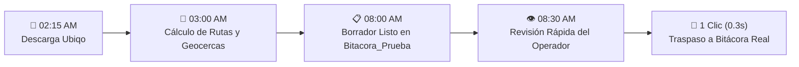

# 📘 Manual de Operación Diaria — Sistema de Auditorías SMARTCORP
*Versión 4.0 — 25 Septiembre 2026 — Guía Práctica de Uso Diario*

| Campo | Detalle Operativo |
| :--- | :--- |
| **Dirigido a** | Asistentes Administrativos, Supervisores de Cuadrilla, Auxiliares de Obra y Jefes de Operaciones |
| **Versión** | **4.0.0** (Operación Diaria, Semáforos, Tolerancia Nocturna y Cero Carga en Logs) |
| **Fecha de Emisión** | 25 de Septiembre de 2026 |
| **Documento Rector** | Basado en el SOP y Catálogo de Reglas de Negocio v6.0 |
| **Soporte Técnico** | Equipo de Automatización e Infraestructura SMARTCORP |

---

## 📚 Tabla de Contenidos

1. [¿Qué Hace el Sistema por Ti?](#1-qué-hace-el-sistema-por-ti)
2. [El Procedimiento Diario en 3 Pasos (Tu Rutina Matutina)](#2-el-procedimiento-diario-en-3-pasos-tu-rutina-matutina)
   - Paso 1: Abrir la Bitácora en Google Sheets
   - Paso 2: Revisar la Hoja Borrador (`Bitacora_Prueba`)
   - Paso 3: Traspasar a Producción (`🚀 Procesar GPS en Bitácora Real`)
3. [Catálogo Visual del Menú `🔍 Auditorías SMARTCORP`](#3-catálogo-visual-del-menú--auditorías-smartcorp)
4. [Guía Visual de Alertas: Cómo Resolver Cada Semáforo](#4-guía-visual-de-alertas-cómo-resolver-cada-semáforo)
   - Alerta `⚠️ [NOCTURNO PENDIENTE]`
   - Alerta `[GPS] REVISAR: El vehículo no visitó la geocerca`
   - Alerta `[GPS] REVISAR: Esta partida no tiene unidad asignada`
   - Alerta `[GPS] REVISAR: Múltiples tramos / Salida tardía`
5. [Auditoría de Reportes de Instalación (`REPORTE ENV.`)](#5-auditoría-de-reportes-de-instalación-reporte-env)
   - Tabla de Códigos (`SI`, `FT`, `NO`, `NA`)
   - Nueva Regla de Tolerancia Nocturna (`Día + 1`)
6. [Manejo de Casos Especiales Frecuentes](#6-manejo-de-casos-especiales-frecuentes)
   - Cuadrillas que viajan juntas (Acomodo en Bloque)
   - Días de oficina o camioneta en taller (`SMARTHAUS GASTOS`)
   - Ausencias, incapacidades y vacaciones (Horario Protegido)
7. [Mejora Continua: ¿Por qué No Tienes que Llenar Bitácoras de Errores?](#7-mejora-continua-por-qué-no-tienes-que-llenar-bitácoras-de-errores)
8. [Preguntas Frecuentes (FAQ)](#8-preguntas-frecuentes-faq)

---

## 1. ¿Qué Hace el Sistema por Ti?

El sistema de auditorías de SMARTCORP está diseñado para eliminar el 95% del trabajo manual de captura y auditoría. Mientras descansas, el robot trabaja en la madrugada para que a las 8:00 AM encuentres la jornada calculada:



### Principales Beneficios:
* **Kilómetros Exactos:** Suma la distancia recorrida por cada vehículo sin errores humanos.
* **Tiempos Reales de Obra:** Detecta la hora de llegada a las instalaciones del cliente y la salida hacia oficina.
* **Protección de Nómina:** Respeta al 100% las ecuaciones contables de `ID`, `SAP` y `CÁLCULO HORAS`.
* **Auditoría Imparcial:** Califica automáticamente si los reportes de instalación fueron enviados a tiempo.
* **Aprendizaje Silencioso:** Si corriges un dato, el sistema toma nota en segundo plano sin pedirte llenar formatos adicionales.

---

## 2. El Procedimiento Diario en 3 Pasos (Tu Rutina Matutina)

Sigue este procedimiento todos los días hábiles a partir de las **08:15 AM**:

### **Paso 1: Abrir la Bitácora en Google Sheets**
Abre tu navegador y entra al archivo maestro de cálculo **`Bitácora SMARTCORP`**.

---

### **Paso 2: Revisar la Hoja Borrador (`Bitacora_Prueba`)**
1. En la parte inferior de la ventana, da clic en la pestaña llamada **`Bitacora_Prueba`**.
2. Esta pestaña contiene exactamente las filas correspondientes al día de trabajo que el robot procesó en la madrugada.
3. Observa las siguientes columnas clave:
   * **`UNIDAD`:** Camioneta asignada a cada colaborador.
   * **`HORA DE SALIDA` / `HORA LLEG PROY`:** Hora en que salieron de oficina y hora en que llegaron al cliente.
   * **`HORA SAL PROY` / `HORA DE ENTRADA`:** Hora en que terminaron en obra y regreso a base.
   * **`KM`:** Kilometraje total acumulado.
   * **`REV` y `OBSERVACIONES`:** Si el robot detectó alguna anomalía, verás la palabra `"REVISAR"` con una explicación clara.
4. **Si todo coincide con los reportes de los supervisores:** No necesitas modificar nada.
5. **Si necesitas corregir algo (ej. una hora de salida diferente o un proyecto mal escrito):** Modifica la celda directamente en `Bitacora_Prueba` como lo harías normalmente.

---

### **Paso 3: Traspasar a Producción (`🚀 Procesar GPS en Bitácora Real`)**
Una vez que estés conforme con los datos en `Bitacora_Prueba`:
1. Dirígete a la barra superior de menús de Google Sheets.
2. Da clic en el menú **`🔍 Auditorías SMARTCORP`**.
3. Selecciona la opción:  
   👉 **`🚀 Procesar GPS en Bitácora Real`**
4. Aparecerá un mensaje en pantalla indicando que los datos se están volcando. En **menos de 3 segundos**:
   * Las filas quedarán guardadas formalmente en la hoja oficial **`Bitácora`**.
   * Se calificarán los reportes de instalación (`REPORTE ENV.`).
   * Se registrarán silenciosamente las discrepancias reales para que el robot aprenda.
5. ¡Listo! Has concluido la auditoría del día.

---

## 3. Catálogo Visual del Menú `🔍 Auditorías SMARTCORP`

El menú personalizado se encuentra en la barra superior de tu hoja de cálculo. A continuación se detalla para qué sirve cada botón:

```
🔍 Auditorías SMARTCORP
├── 🚀 Procesar GPS en Bitácora Real    👉 El botón principal de cada mañana. Vuelca el borrador validado a nómina.
├── 🔄 Recalcular Diagnóstico y Prueba  👉 Vuelve a calcular el borrador si añadiste geocercas o vehículos nuevos.
├── 🧪 Procesar GPS en Hoja de Prueba   👉 Fuerza el cálculo del borrador sin tocar la Bitácora Real.
├── ──────────────────────────────────
├── 🔬 Generar Diagnóstico Detallado GPS👉 Abre la radiografía analítica de tramos y visitas en Diagnostico_GPS.
├── 📥 Forzar Descarga Ubiqo (GitHub)   👉 Solicita a la plataforma GPS que descargue el archivo hoy mismo a deshoras.
├── 📤 Cargar Archivo GPS Manual        👉 Permite subir un archivo Excel de Ubiqo desde tu computadora.
├── ──────────────────────────────────
├── 📋 Llenar Reporte Enviado por Fecha 👉 Audita el cumplimiento de reportes para un día específico (DD/MM/YYYY).
├── 📅 Llenar Reporte Enviado por Periodo👉 Audita reportes para una quincena, semana o mes completo.
├── ──────────────────────────────────
├── ⏰ Configurar Triggers Automáticos  👉 Activa los robots automáticos de la madrugada y las 8:00 AM en 1 clic.
└── ℹ️ Acerca del sistema de auditorías  👉 Muestra los créditos y versión del sistema instalada.
```

---

## 4. Guía Visual de Alertas: Cómo Resolver Cada Semáforo

Cuando el robot detecta una situación inusual, colocará la etiqueta `REVISAR` en la columna **`REV`** y detallará el motivo en **`OBSERVACIONES`**. A continuación se explica qué hacer en cada caso:

### ⚠️ Alerta 1: `⚠️ [NOCTURNO PENDIENTE]: Tramo posterior a oficina detectado`
* **¿Qué significa?** La camioneta regresó a la oficina matriz antes de las 18:00 hrs (cerrando su jornada normal), pero el dispositivo GPS registró que el vehículo volvió a salir de noche (después de las 18:00 hrs) y ese viaje nocturno no está registrado en la Bitácora.
* **¿Qué debes hacer?**
  1. Pregunta al supervisor o líder de cuadrilla si hubo una guardia nocturna, rescate o servicio de emergencia esa noche.
  2. Si hubo servicio nocturno: Inserta una fila nueva en `Bitacora_Prueba` con el nombre del técnico, la camioneta, el proyecto nocturno y el horario real trabajado (ej. `21:00` a `02:00`).
  3. Si fue un movimiento interno de taller o traslado administrativo no laborable: Deja las observaciones y elimina la palabra `REVISAR`.

---

### ⚠️ Alerta 2: `[GPS] REVISAR: El vehículo no visitó la geocerca configurada`
* **¿Qué significa?** La camioneta estuvo circulando durante el día, pero sus paradas no coincidieron dentro del círculo geográfico registrado para ese cliente.
* **¿Qué debes hacer?**
  1. **Si el técnico sí fue a la obra:** Es probable que la caseta de acceso o el estacionamiento esté retirado del punto central registrado. Escribe manualmente en `HORA LLEG PROY` y `HORA SAL PROY` las horas de obra y avisa al equipo técnico para que **amplíen el radio** de esa geocerca en la hoja `Proyectos_GPS`.
  2. **Si el técnico fue enviado a otra obra diferente:** Corrige el nombre del `PROYECTO` en la celda correspondiente y da clic en `🔄 Recalcular Diagnóstico y Prueba`.

---

### ⚠️ Alerta 3: `[GPS] REVISAR: Esta partida no tiene unidad asignada`
* **¿Qué significa?** La fila tiene un proyecto de campo (`Proyecto instalación`), pero la celda `UNIDAD` está vacía o dice `"NA"`. El robot no puede adivinar en qué camioneta viajó el colaborador.
* **¿Qué debes hacer?**
  1. Pregunta en qué camioneta viajó el colaborador.
  2. Escribe el número de unidad en la celda (ej. `16 (Pick Up 3)`).
  3. Da clic en `🔄 Recalcular Diagnóstico y Prueba`. El sistema rellenará los kilómetros y paradas al instante.

---

### ⚠️ Alerta 4: `[GPS] REVISAR: Múltiples tramos / Salida tardía (10:00 AM)`
* **¿Qué significa?** El vehículo salió de la oficina matriz después de las 09:30 AM (por ejemplo a las 10:00 AM) tras realizar preparativos.
* **¿Qué debes hacer?**
  1. Si el horario tardío es correcto porque estaban cargando material pesado: Déjalo como está y borra la palabra `REVISAR`.
  2. Si el técnico llegó a las 08:00 AM a oficina y debe pagarse su jornada completa: Corrige la celda `DE` a `08:00`. El sistema registrará la corrección silenciosamente.

---

## 5. Auditoría de Reportes de Instalación (`REPORTE ENV.`)

El sistema audita automáticamente la columna **`REPORTE ENV.`** cruzando los datos contra las respuestas de los técnicos en el libro `REPORTES_GENERAL`:

### 5.1 Tabla de Códigos y Semáforos

| Código | Color Visual | Significado Operativo | Acción Requerida |
| :---: | :---: | :--- | :--- |
| **`SI`** | 🟢 Verde | **Reporte enviado a tiempo.** El técnico llenó su reporte dentro del día programado. | Ninguna. Todo en orden. |
| **`FT`** | 🟡 Amarillo | **Fuera de Tiempo.** El técnico sí envió el reporte, pero lo llenó días después de realizar el trabajo. | Exhortar al líder de cuadrilla a mandar su reporte el mismo día de la instalación. |
| **`NO`** | 🔴 Rojo | **Falta Reporte.** Es una obra de instalación y no existe ningún reporte en el sistema. | Solicitar de inmediato el reporte al líder antes del cierre de nómina. |
| **`NA`** | ⚪ Gris | **No Aplica.** Partidas administrativas, días de descanso, permisos o gastos de oficina. | Ninguna. No requiere reporte. |

### 5.2 🌙 Nueva Regla de Tolerancia Nocturna (`Día + 1`)
Sabemos que muchas cuadrillas terminan trabajos muy noche o en turnos de madrugada (ej. concluir a las 22:00 hrs o a las 03:00 AM) y no es justo marcarlos como Fuera de Tiempo (`FT`) si llenan su reporte la mañana siguiente.

**La Regla de Tolerancia establece que:**
* Si una jornada termina a las **20:00 hrs o más tarde**, o si es un **turno nocturno** que cruza la medianoche:
* El líder tiene autorización para enviar su reporte hasta el día siguiente (**Día + 1**).
* El sistema reconocerá automáticamente el envío matutino y lo calificará como **`SI` (A Tiempo)** sin penalización.

---

## 6. Manejo de Casos Especiales Frecuentes

### 6.1 Cuadrillas que Viajan Juntas (Acomodo en Bloque)
Cuando 2 o más técnicos viajan en la misma camioneta para un proyecto, el robot respeta a la cuadrilla como una sola unidad:
* Las filas del proyecto se mantienen contiguas.
* Si la cuadrilla tuvo que pasar primero a la oficina matriz a cargar equipo antes de salir a carretera, el robot insertará las filas administrativas (`SMARTHAUS GASTOS`) de todos los integrantes **juntas arriba del proyecto**.
* Si tuvieron que regresar a dejar herramienta a las 19:00 hrs, las filas administrativas se insertarán **juntas abajo del proyecto**.
* Las horas de salida y llegada se sincronizan perfectamente para que no haya traslapes.

---

### 6.2 Días de Oficina o Camioneta en Taller (`SMARTHAUS GASTOS`)
Si una camioneta se quedó en el taller mecánico o un técnico estuvo apoyando en bodega:
* El proyecto debe llamarse `"SMARTHAUS GASTOS"`.
* El horario se fijará automáticamente de **`08:00` a `18:00`**.
* La columna `REPORTE ENV.` se marcará sola como **`NA`**.
* Las columnas de telemetría GPS quedarán en blanco automáticamente, ya que no hubo traslado a clientes.

---

### 6.3 Ausencias, Incapacidades y Vacaciones (Horario Protegido)
Si un colaborador tuvo falta justificada, vacaciones, permiso o incapacidad médica del IMSS:
* El robot **jamás inventará datos GPS**.
* El horario se protegerá estrictamente de **`08:00` a `18:00`** para efectos de nómina estándar.
* Las columnas de kilómetros, paradas y horas de proyecto quedarán completamente vacías.

---

## 7. Mejora Continua: ¿Por qué No Tienes que Llenar Bitácoras de Errores?

En muchas empresas, cuando un sistema automático se equivoca, el personal tiene que llenar formatos tediosos o bitácoras de incidencias. En SMARTCORP **no tienes que hacer nada de eso**.

### ¿Cómo Funciona la Detección Silenciosa?
1. En la madrugada, cuando el robot calcula `Bitacora_Prueba`, toma una **foto oculta** de lo que propuso.
2. Tú revisas la hoja como siempre. Si el 80% de las filas están bien, las dejas tal cual.
3. Si cambiaste una hora de llegada porque la geocerca era muy chica, o si ajustaste un horario, simplemente escribes el valor correcto.
4. Al hacer clic en **`🚀 Procesar GPS en Bitácora Real`**, el sistema compara tu versión final contra su foto original:
   * **Si descartaste una alerta porque viste que todo estaba bien:** El sistema no genera ruido ni bitácoras innecesarias.
   * **Si corregiste una hora o un dato:** El sistema anota en una hoja especial (`Log_Mejora_Continua` en el libro de GPS) exactamente qué cambiaste y la recomendación técnica (ej. *"Ampliar geocerca de este cliente"* o *"Verificar antena GPS"*).
5. Con este historial, los ingenieros calibran los radios y las reglas para que el robot sea cada vez más inteligente y te dé menos trabajo en el futuro.

---

## 8. Preguntas Frecuentes (FAQ)

#### ¿Qué hago si al llegar a las 8:00 AM la pestaña `Bitacora_Prueba` está vacía?
No te preocupes. A veces la plataforma de Ubiqo tarda unos minutos más en liberar el reporte. Ve al menú superior **`🔍 Auditorías SMARTCORP`** y da clic en **`📥 Forzar Descarga Ubiqo (GitHub)`**. Espera 1 minuto y luego presiona **`🔄 Recalcular Diagnóstico y Prueba`**.

#### ¿Qué pasa si doy clic dos veces al botón `🚀 Procesar GPS en Bitácora Real`?
El sistema cuenta con candados anti-duplicidad. No duplicará filas ni corromperá tu Bitácora. Sin embargo, lo ideal es presionarlo una sola vez por día tras concluir tu validación.

#### ¿Puedo agregar o eliminar columnas en la Bitácora Real?
**Sí.** El sistema lee los encabezados por su nombre oficial (no por su número de columna). Puedes insertar o mover columnas y el sistema seguirá funcionando perfectamente sin desfasar la información. Solo asegúrate de no borrar el nombre de los encabezados principales.

#### ¿Se borran las fórmulas de SAP o ID cuando traspaso los datos?
**No.** El sistema protege estrictamente las fórmulas contables de `ID`, `SAP` y `CÁLCULO HORAS`. Si se insertan filas nuevas por gastos o talleres, el sistema copia y arrastra las fórmulas automáticamente desde la fila superior.

---
*Fin del Manual de Usuario — SMARTCORP 2026*
