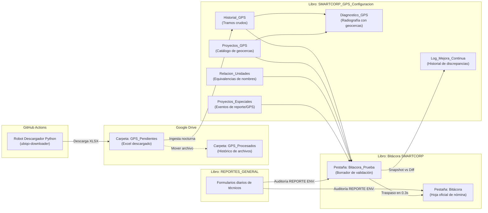
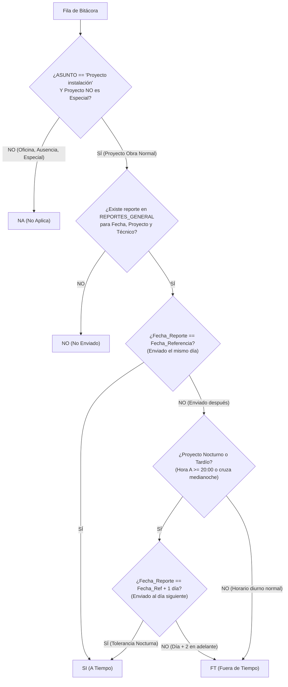
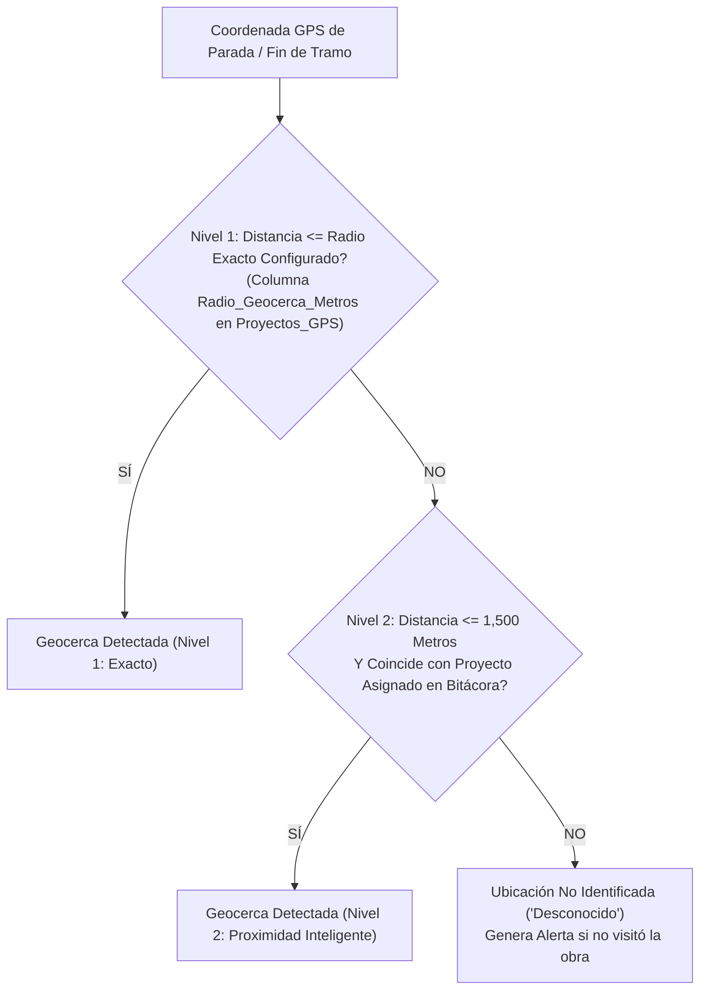
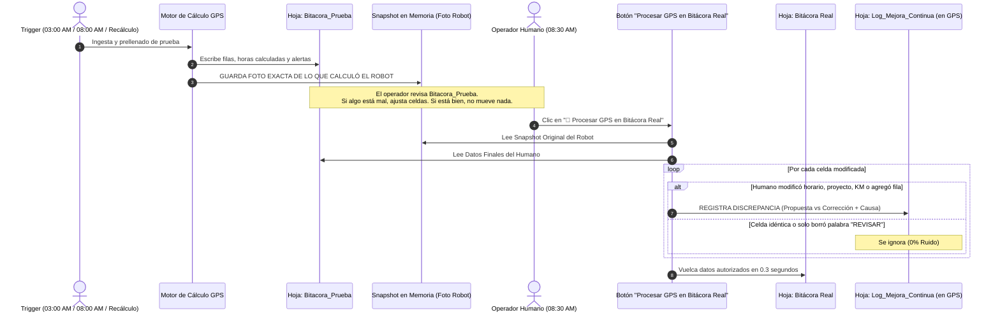

# 📜 Catálogo Maestro de Reglas de Negocio GPS y Reportes Enviados — SMARTCORP
*Versión 6.0 — 25 Septiembre 2026 — Documento de Verdad Absoluta*

> **DOCUMENTO SOP (STANDARD OPERATING PROCEDURE) Y REGLAS DE NEGOCIO DEL SISTEMA SMARTCORP.**
> Este es el documento rector del sistema automatizado de telemetría y auditoría de SMARTCORP.
> Cualquier modificación al código, triggers, menús o estructuras de datos debe alinearse estrictamente con lo aquí estipulado.
> Toda discrepancia operativa entre áreas se resuelve consultando este documento como la única fuente de verdad técnica y operativa.

---

## 🏗️ 1. FUENTES DE DATOS Y CONTRATOS DE INFORMACIÓN

El sistema opera a través de dos hojas maestras principales de Google Sheets y un repositorio automatizado en GitHub:



### 1.1 Catálogo de Fuentes de Datos

| Libro | Pestaña | Columnas Clave | Propósito Operativo |
| :--- | :--- | :--- | :--- |
| **Bitácora SMARTCORP** | `Bitácora` | `ID`, `SAP`, `FECHA`, `PROYECTO`, `NOMBRE`, `ROL`, `UNIDAD`, `DE`, `A`, `CÁLCULO HORAS`, `HORAS EXTRA`, `Hrs X Pagadas`, `REPORTE ENV.`, `ASUNTO`, `REV`, `HORA DE SALIDA`, `HORA LLEG PROY`, `HORA SAL PROY`, `HORA DE ENTRADA`, `TIEMPO RECORRIDO`, `TIEMPO DE PARADAS`, `PARADAS`, `REGRESOS`, `OBSERVACIONES`, `KM` | Hoja oficial de producción utilizada para el pago de nómina, control de asistencia, horas extra y costos de viáticos. |
| **Bitácora SMARTCORP** | `Bitacora_Prueba` | *Mismos encabezados dinámicos que Bitácora* | Hoja espejo borrador donde el robot prellena automáticamente la jornada del día para que el usuario valide antes de tocar producción. |
| **REPORTES_GENERAL** | `REPORTES_GENERAL` | `Fecha_Reporte`, `NombreProyecto`, `Fecha_Referencia`, `Equipo_Trabajo_Manual`, `Timestamp` | Registro de formularios enviados desde campo por líderes y técnicos de cuadrilla. |
| **SMARTCORP_GPS_Configuracion** | `Proyectos_GPS` | `ID_Proyecto`, `Nombre_Proyecto`, `Latitud`, `Longitud`, `Radio_Geocerca_Metros` | Catálogo de geocercas maestras de clientes y oficinas. |
| **SMARTCORP_GPS_Configuracion** | `Relacion_Unidades` | `Nombre_GPS`, `Nombre_Bitacora` | Diccionario de traducción para homologar nombres del proveedor de GPS con los nombres de la Bitácora. |
| **SMARTCORP_GPS_Configuracion** | `Proyectos_Especiales` | `Nombre_Proyecto` (Columna A) | Lista negra de proyectos exentos de validar geocercas, sin horas de salida/llegada a proyecto y con reporte calificado como `NA`. |
| **SMARTCORP_GPS_Configuracion** | `Historial_GPS` | `Unidad`, `Fecha`, `Hora_Inicio`, `Lat_Lon_Inicio`, `Hora_Fin`, `Lat_Lon_Fin`, `Distancia_KM`, `Duracion`, `Paradas_Duracion`, `Estado` | Almacén histórico de todos los tramos de telemetría extraídos de los archivos XLSX de Ubiqo. |
| **SMARTCORP_GPS_Configuracion** | `Diagnostico_GPS` | `Unidad`, `Fecha`, `Tramo_ID`, `Hora_Inicio`, `Geocerca_Inicio`, `Hora_Fin`, `Geocerca_Fin`, `Distancia_KM`, `Duracion`, `Proyecto_Bitacora` | Radiografía visual tramo a tramo que permite auditar qué proyecto y geocerca tocó la unidad en cada viaje del día. |
| **SMARTCORP_GPS_Configuracion** | `Log_Mejora_Continua` | `Fecha_Jornada`, `Fecha_Hora_Aprobacion`, `Tecnico`, `Unidad`, `Proyecto`, `Campo_Modificado`, `Valor_Propuesto_Robot`, `Valor_Final_Humano`, `Causa_Discrepancia`, `Accion_Recomendada` | Repositorio de discrepancias reales detectadas entre la propuesta del robot y la corrección humana, base del aprendizaje continuo. |

---

## 🔄 2. CICLO DE VIDA DE DATOS Y AUTOMATIZACIÓN DE 24 HORAS

El sistema opera mediante una secuencia temporal estricta de 4 activadores automáticos en la nube más acciones manuales a demanda:

```mermaid
timeline
    title Cronología Diaria del Sistema SMARTCORP (Hora Centro de México / CST UTC-6)
    02:15 AM : Intento 1 GitHub Actions : Robot Python descarga reporte Ubiqo a GPS_Pendientes
    02:50 AM : Trigger 1 Apps Script : Rescate nocturno si el archivo no ha llegado a Drive
    03:00 AM : Trigger 2 Apps Script : Cadena Nocturna Automática : Ingesta a Historial_GPS : Generación de Diagnóstico : Prellenado de Bitacora_Prueba : Foto Snapshot Base
    08:00 AM / 08:15 AM : Trigger 3 Apps Script / GitHub : Rescate Matutino si GitHub entregó tarde : Ingesta y prellenado de rescate : Actualización de Foto Snapshot
    08:30 AM a 05:00 PM : Operación Humana : Revisión visual de Bitacora_Prueba : Ajustes manuales si aplican : Clic en "Procesar GPS en Bitácora Real" : Comparativa Diff y Log de Mejora Continua
    10:00 PM : Trigger 4 Apps Script : Candado Nocturno Automático : Si el humano olvidó procesar en el día, el sistema vuelca a Bitácora Real
```

### Detalle de los 4 Triggers Oficiales:

1. **02:15 AM (GitHub Actions — Intento 1):**
   * Configurado en `.github/workflows/run_ubiqo.yml` bajo el cron `15 8 * * 2-6` (08:15 UTC = 02:15 AM México).
   * Se ejecuta al minuto `:15` para evitar la congestión masiva de servidores de GitHub en los minutos `:00`.
   * Descarga el reporte Excel de la flota completa del día anterior desde la plataforma Ubiqo y lo deposita en la carpeta de Google Drive `GPS_Pendientes`.
   * Posee candado anti-duplicados: si el archivo de la fecha ya existe en Drive, aborta para no duplicar datos.

2. **02:50 AM (Trigger 1 Apps Script — Rescate Nocturno):**
   * Función: `auditVerificarDescargaNocturnaUbiqo()`.
   * Revisa si hay algún archivo `.xlsx` en `GPS_Pendientes`. Si la carpeta está vacía (por retraso en Ubiqo o fallo en GitHub), envía una señal de despacho `repository_dispatch` vía API a GitHub Actions para forzar la descarga de emergencia.

3. **03:00 AM (Trigger 2 Apps Script — Cadena Nocturna Completa):**
   * Función: `auditEjecutarCadenaNocturnaAutomatica()`.
   * Ejecuta en secuencia:
     1. **Ingesta:** Lee los archivos de `GPS_Pendientes`, extrae los tramos crudos y paradas acumuladas, los inserta en `Historial_GPS` con estado `"Pendiente"` y traslada el archivo físico a `GPS_Procesados`.
     2. **Diagnóstico:** Genera la radiografía en `Diagnostico_GPS` cruzando los tramos con las geocercas y proyectos programados.
     3. **Prellenado:** Prellena la hoja borrador `Bitacora_Prueba` aplicando los 17 casos de negocio, el acomodo de cuadrillas en bloque y la coordinación de horarios.
     4. **Snapshot:** Guarda la "foto base" de la propuesta del robot para el motor de mejora continua.

4. **08:00 AM / 08:15 AM (Trigger 3 Apps Script / GitHub — Rescate Matutino):**
   * GitHub Actions corre el cron de rescate a las 08:15 AM CST (`15 14 * * 2-6` UTC).
   * Apps Script ejecuta `auditVerificarEIngerirPendientesMatutino8AM()` a las 08:00 AM.
   * Si por alguna eventualidad Ubiqo estuvo fuera de servicio en la madrugada pero entregó a las 6:00 o 7:00 AM, este activador detecta el archivo en `GPS_Pendientes`, realiza la ingesta, genera el diagnóstico, prellena `Bitacora_Prueba` y actualiza la foto del snapshot antes de que el personal comience su jornada.

5. **10:00 PM (Trigger 4 Apps Script — Candado Nocturno a Producción):**
   * Función: `auditVerificarYProcesarPendientes10PM()`.
   * Revisa si en `Historial_GPS` quedaron fechas con estado `"Pendiente"`. Si el usuario no dio clic en el botón durante el día (por vacaciones, emergencias o descuido), el sistema efectúa el traspaso masivo de `Bitacora_Prueba` a `Bitácora Real` de forma 100% automática.

---

## 📋 3. MÓDULO — AUDITORÍA DE REPORTES ENVIADOS (`REPORTE ENV.`)

### 3.1 Propósito
Auditar de forma automatizada si los técnicos en campo llenaron en tiempo y forma su reporte de trabajo en el formulario oficial (`REPORTES_GENERAL`), cruzando su asistencia contra las partidas de la `Bitácora`.

### 3.2 Clasificación de Resultados en Columna `REPORTE ENV.`



| Código | Significado | Condición Exacta de Negocio |
| :---: | :--- | :--- |
| **`SI`** | **Reporte enviado a tiempo** | Se cumple **CUALQUIERA** de las dos condiciones:<br>1. **Regla Estándar Diurna:** El reporte se envió el mismo día en que se realizó el trabajo (`Fecha_Reporte == Fecha_Referencia`).<br>2. **Regla de Tolerancia Nocturna / Fin Tardío:** Si el proyecto finalizó a las **20:00 hrs o más tarde**, o si es un **turno nocturno cruzado** (`A < DE`, ej. 18:00 a 01:00 AM), y el reporte fue enviado al **día natural siguiente** (`Fecha_Reporte == Fecha_Referencia + 1 día`). |
| **`FT`** | **Fuera de Tiempo** | Existen reportes registrados en `REPORTES_GENERAL` para ese técnico y proyecto, pero fueron enviados fuera de su plazo permitido:<br>• Para turnos normales: Enviados a partir del día siguiente (`Día + 1` en adelante).<br>• Para turnos nocturnos o tardíos: Enviados a partir del segundo día en adelante (`Día + 2` o más). |
| **`NO`** | **No enviado** | La partida es un `Proyecto instalación` en un proyecto regular de obra, pero **NO se encontró ningún reporte** enviado por ese técnico para ese proyecto en esa fecha de trabajo. |
| **`NA`** | **No Aplica** | Se asigna obligatoriamente si se cumple **CUALQUIERA** de los siguientes supuestos:<br>1. El `ASUNTO` en la Bitácora **NO** es igual a `"Proyecto instalación"` (ej. `Oficina`, `SMARTHAUS GASTOS`, `Traslado`, `Capacitación`, `Permiso`, `Incapacidad`, `Falta`, etc.).<br>2. El proyecto está registrado en la pestaña `Proyectos_Especiales` (exento de reporte por acuerdo comercial).<br>3. El proyecto es un proyecto interno del sistema (`SMARTHAUS GASTOS`, `OFICINA`, `SMARTCORP`). |

### 3.3 Regla de Tolerancia Nocturna y Fin Tardío (Fórmula de Plazo Justo)
Un técnico que concluye su jornada a las 22:00 hrs o a la 01:00 AM no puede ser penalizado con `FT` por no enviar el formulario antes de las 23:59 del mismo día.
* **Condición de activación:**  
  $$\text{Hora Fin } (A) \ge 20.0 \quad \lor \quad \text{Hora Entrada } \ge 20.0 \quad \lor \quad A < DE \text{ (Turno cruzado)}$$
* **Evaluación temporal:**
  $$\Delta \text{Días} = \text{Fecha\_Reporte} - \text{Fecha\_Referencia}$$
  $$\text{Resultado} = \begin{cases} 
  \mathbf{SI} & \text{si } \Delta \text{Días} = 0 \\ 
  \mathbf{SI} & \text{si } \Delta \text{Días} = 1 \ \land \ \text{esTardioONocturno} \\ 
  \mathbf{FT} & \text{si } \Delta \text{Días} \ge 1 \ \land \ \neg\text{esTardioONocturno} \\ 
  \mathbf{FT} & \text{si } \Delta \text{Días} \ge 2 \ \land \ \text{esTardioONocturno} 
  \end{cases}$$

### 3.4 Criterio Triclave de Coincidencia (Match Engine)
Para vincular una fila de la Bitácora con un formulario de `REPORTES_GENERAL`, el motor evalúa:
1. **Fecha de Trabajo:** $\text{Bitácora.FECHA} \equiv \text{REPORTES\_GENERAL.Fecha\_Referencia}$ (ambas en formato `DD/MM/YYYY`).
2. **Proyecto Normalizado:** Comparación canónica sin acentos, mayúsculas ni dobles espacios:  
   `auditReporteNormalizar(Bitácora.PROYECTO) === auditReporteNormalizar(REPORTES_GENERAL.NombreProyecto)`
3. **Nombre del Técnico en Cuadrilla:** La columna `Equipo_Trabajo_Manual` de `REPORTES_GENERAL` puede contener múltiples personas separadas por comas, diagonales o la conjunción " y " (ej. *"Luis Rodríguez / Eduardo Ramírez"*). El sistema tokeniza la celda y evalúa si el nombre del técnico de la Bitácora coincide con alguno de los participantes.

---

## 🚗 4. MÓDULO — AUDITORÍA GPS, TELEMETRÍA Y GEOCERCAS

### 4.1 Algoritmo de Detección de Geocercas (2 Niveles de Tolerancia)
Para determinar si un vehículo estuvo físicamente en un proyecto o en la oficina matriz, se calcula la distancia geodésica mediante la fórmula de Haversine:



* **Nivel 1 (Radio Exacto Configurado):** Si la distancia es menor o igual al radio especificado en `Proyectos_GPS` (por defecto 100 metros si la celda está vacía), la geocerca se valida al 100%.
* **Nivel 2 (Proximidad Inteligente — 1,500 Metros):** Si el vehículo se estacionó fuera del perímetro oficial (estacionamientos externos de parques industriales, casetas de acceso alejadas o plantas de gran extensión), el sistema amplía la tolerancia hasta **1,500 metros** siempre que la geocerca coincida con el proyecto asignado a esa cuadrilla en la Bitácora.
* **Geocerca de Oficina Matriz (SMARTCORP):** Coordenadas fijas `Lat: 20.6191, Lon: -100.4079` con un radio estricto de **250 metros**.

---

### 4.2 Matriz Exhaustiva de los 17 Casos Operativos de Bitácora

El sistema clasifica la jornada de cada técnico en uno de los 17 casos operativos para determinar con exactitud matemática qué columnas se llenan y cuáles deben permanecer estrictamente vacías:

| Caso | Tipo de Jornada | Horario Base | Salida Oficina | Llegada Proy | Salida Proy | Entrada Oficina | KM / Recorrido / Paradas | Rev / Observaciones |
| :---: | :--- | :---: | :---: | :---: | :---: | :---: | :---: | :---: |
| **1** | **Proyecto Único Regular** (Día estándar en obra) | `08:00 - 18:00` | Hora real | Hora real | Hora real | Hora real | Métricas completas | Vacio si visitó geocerca |
| **2** | **Inicio Tardío** (Sale de oficina después de las 09:00 AM) | Calculado $\ge 09:00$ | **VACÍO** ➖ | **VACÍO** ➖ | Hora real | Hora real | Métricas del proyecto | Genera `SMARTHAUS GASTOS` previo |
| **3** | **Retorno Temprano** (Vuelve a oficina antes de las 17:00) | `08:00` - Calculado | Hora real | Hora real | **VACÍO** ➖ | **VACÍO** ➖ | Métricas del proyecto | Genera `SMARTHAUS GASTOS` posterior |
| **4** | **Horas Extra Regulares** (Retorno entre 19:00 y 21:00) | `08:00` - Real redondeado | Hora real | Hora real | Hora real | Hora real | Métricas completas | Calcula Horas Extra ($leDec - 18.0$) |
| **5** | **Horas Extra Extremas** (Retorno después de las 21:00) | `08:00` - Real redondeado | Hora real | Hora real | Hora real | Hora real | Métricas completas | Horas extra + Alerta de validación |
| **6** | **Primer Proyecto de un Multi-Proyecto** | `08:00` - Salida P1 | Hora real | Hora real | **VACÍO** ➖ | **VACÍO** ➖ | Métricas tramo P1 | Sin horas de entrada a oficina |
| **7** | **Proyecto Intermedio** (Proyecto 2 de 3) | Fin P1 - Inicio P3 | **VACÍO** ➖ | **VACÍO** ➖ | **VACÍO** ➖ | **VACÍO** ➖ | Métricas tramo intermedio | Horas exteriores vacías |
| **8** | **Último Proyecto de un Multi-Proyecto** | Fin P(n-1) - `18:00` | **VACÍO** ➖ | **VACÍO** ➖ | Hora real | Hora real | Métricas retorno | Sin horas de salida de oficina |
| **9** | **Proyecto Especial / Foráneo Exento** | `08:00 - 18:00` | Hora real | **VACÍO** ➖ | **VACÍO** ➖ | Hora real | KM y tiempos reales | `NA` en reporte, sin alerta geocerca |
| **10** | **Fila Administrativa `SMARTHAUS GASTOS`** | Horas calculadas | **VACÍO** ➖ | **VACÍO** ➖ | **VACÍO** ➖ | **VACÍO** ➖ | **VACÍO** ➖ | `NA` en reporte, asunto `Oficina` |
| **11** | **Vehículo No Visitó Geocerca del Proyecto** | `08:00 - 18:00` | Hora real | **VACÍO** ➖ | **VACÍO** ➖ | Hora real | KM y tiempos reales | `REV = REVISAR`, alerta geocerca |
| **12** | **Proyecto Sin Geocerca en Catálogo** | `08:00 - 18:00` | Hora real | **VACÍO** ➖ | **VACÍO** ➖ | Hora real | KM y tiempos reales | `REV = REVISAR`, falta catálogo |
| **13** | **Regresos Múltiples al Mismo Proyecto** | `08:00 - 18:00` | Primer salida | Primer llegada | Última salida | Última entrada | Métricas acumuladas | Columna `REGRESOS` = N vueltas |
| **14** | **Unidad Administrativa / NA** (Sin GPS) | `08:00 - 18:00` | **VACÍO** ➖ | **VACÍO** ➖ | **VACÍO** ➖ | **VACÍO** ➖ | **VACÍO** ➖ | Sin datos GPS, intacto |
| **15** | **Ausencia / Falta / Incapacidad / Vacaciones** | `08:00 - 18:00` | **VACÍO** ➖ | **VACÍO** ➖ | **VACÍO** ➖ | **VACÍO** ➖ | **VACÍO** ➖ | Sin GPS, preserva ausencia |
| **16** | **Turno Nocturno Cruzado** (`18:00 a 01:00`) | Horario programado | Hora real (si hubo) | **VACÍO** ➖ | **VACÍO** ➖ | **VACÍO** ➖ | Tramos de su turno | `REV = REVISAR (Nocturno manual)` |
| **17** | **Salida Nocturna No Registrada** (Movimiento $\ge$ 18:15) | Horario diurno | Horas diurnas | Horas diurnas | Horas diurnas | Horas diurnas | Solo tramos diurnos | `REV = REVISAR`, Alerta nocturna |

---

### 4.3 Regla de Coordinación y Supresión de Horas con Oficina al Inicio o Fin

Cuando una jornada combina trabajo administrativo en oficina matriz y trabajo en campo, los horarios exteriores se coordinan de forma simétrica:



```mermaid
graph TD
    subgraph CasoA["Escenario A: Oficina al Inicio (Inicio Tardío)"]
        A1["Fila 1: SMARTHAUS GASTOS (08:00 a 10:00)"]
        A2["Fila 2: PROYECTO CAMPO (10:00 a 18:00)"]
        A1 -.->|Cuenta como Proyecto 1| A2
        A2 -.->|Hora Salida: VACÍA<br/>Hora Lleg Proy: VACÍA| A3["Sal Proy y Entrada: Con horas reales"]
    end
    
    subgraph CasoB["Escenario B: Oficina al Final (Retorno Temprano)"]
        B1["Fila 1: PROYECTO CAMPO (08:00 a 16:00)"]
        B2["Fila 2: SMARTHAUS GASTOS (16:00 a 18:00)"]
        B1 -.->|Salida y Lleg Proy: Con horas reales| B3["Hora Sal Proy: VACÍA<br/>Hora Entrada: VACÍA"]
        B3 -.->|Cuenta como Proyecto Final| B2
    end
```

1. **Oficina al Inicio (Fila administrativa previa):**
   * El proyecto en campo **NO es la primera salida de la mañana** (el técnico comenzó trabajando en oficina).
   * **Regla estricta:** En el proyecto de campo **`HORA DE SALIDA`** y **`HORA LLEG PROY`** deben quedar **completamente vacías (`""`)**. Su hora `DE` inicia en el momento en que terminó la oficina (ej. `10:00`).
2. **Oficina al Final (Fila administrativa posterior):**
   * El proyecto en campo **NO es el regreso final del día** (el técnico retornó temprano y concluyó su jornada trabajando en oficina).
   * **Regla estricta:** En el proyecto de campo **`HORA SAL PROY`** y **`HORA DE ENTRADA`** deben quedar **completamente vacías (`""`)**. Su hora `A` corta en el momento en que llegó a oficina (ej. `16:00`).
3. **Oficina al Inicio Y al Final:**
   * El proyecto de campo es un tramo intermedio $\rightarrow$ **Las 4 horas exteriores permanecen vacías**.
4. **Proyecto Único Regular (Sin oficina):**
   * Conserva las 4 horas completas (`HORA DE SALIDA`, `HORA LLEG PROY`, `HORA SAL PROY`, `HORA DE ENTRADA`).

---

### 4.4 Inserción de Filas Administrativas en Bloque por Cuadrilla

Para evitar desorden visual en la Bitácora, cuando dos o más técnicos asisten al mismo proyecto en el mismo vehículo, las filas automáticas de `SMARTHAUS GASTOS` se insertan **agrupadas por bloque de cuadrilla**:

```
ESTRUCTURA DE LECTURA CRONOLÓGICA POR BLOQUE:

[Caso Inicio Tardío: Oficina de 08:00 a 10:00]
Fila 10: Juan Pérez   | SMARTHAUS GASTOS | 08:00 a 10:00 | Oficina
Fila 11: Pedro Soto   | SMARTHAUS GASTOS | 08:00 a 10:00 | Oficina
Fila 12: Juan Pérez   | PROYECTO OBRA    | 10:00 a 18:00 | Proyecto instalación
Fila 13: Pedro Soto   | PROYECTO OBRA    | 10:00 a 18:00 | Proyecto instalación

[Caso Retorno Temprano: Oficina de 16:00 a 18:00]
Fila 10: Juan Pérez   | PROYECTO OBRA    | 08:00 a 16:00 | Proyecto instalación
Fila 11: Pedro Soto   | PROYECTO OBRA    | 08:00 a 16:00 | Proyecto instalación
Fila 12: Juan Pérez   | SMARTHAUS GASTOS | 16:00 a 18:00 | Oficina
Fila 13: Pedro Soto   | SMARTHAUS GASTOS | 16:00 a 18:00 | Oficina
```

* **Algoritmo de Inserción Descendente (Bottom-to-Top):**  
  Para que la inserción de nuevas filas en Google Sheets no desplace ni altere los números de fila calculados para otras cuadrillas, el sistema agrupa los elementos por `blockKey = UNIDAD + '|' + PROYECTO` y **ordena los grupos de mayor a menor fila antes de insertar**. Así, las filas insertadas en la parte inferior nunca alteran las posiciones de las cuadrillas ubicadas arriba.

---

### 4.5 Candado Diurno y Detección de Salidas Nocturnas sin Registrar

Para proteger la integridad de los proyectos diurnos cuando las cuadrillas realizan viajes fuera de horario o guardias nocturnas que aún no han sido capturadas por el personal administrativo:

1. **Candado Diurno Inviolable:**
   * Si una unidad regresa a oficina matriz antes de las 18:00 (ej. a las 17:31:15), el proyecto diurno **cierra definitivamente sus kilómetros y tiempos a esa hora**.
   * **Prohibición de absorción:** Ningún tramo que inicie después de las 18:15 se le sumará jamás al proyecto diurno, evitando inflar tiempos o kilómetros indebidos.
2. **Identificación en `Diagnostico_GPS`:**
   * Si la camioneta vuelve a salir de oficina después de las 18:15 y no existe un proyecto nocturno registrado en Bitácora para esa unidad, el tramo se etiqueta explícitamente en la columna `Proyecto_Bitacora` como:  
     `⚠️ [NOCTURNO PENDIENTE] Sin proyecto en Bitácora (Unidad X, 18:26 hrs)`.
3. **Alerta en `Bitácora` (`REV` y `OBSERVACIONES`):**
   * En la fila diurna de la cuadrilla se añade automáticamente la alerta:  
     `[GPS] ⚠️ ALERTA: Unidad registró salida nocturna (18:26:02, 16.2 km) sin proyecto nocturno asignado en Bitácora.`  
     `REV = "REVISAR"`.
   * Esto permite al operador administrativo saber de inmediato que la cuadrilla tuvo un turno nocturno o guardia y debe capturar el renglón correspondiente a mano.

---

### 4.6 Tratamiento Incondicional de Ausencias e Incapacidades
* Cualquier fila cuyo `PROYECTO` o `ASUNTO` contenga palabras clave de inasistencia (`AUSENCIA`, `INCAPACIDAD`, `FALTA`, `VACACIONES`, `PERMISO`, `SUSPENSION`, `FALTA JUSTIFICADA`):
  * Se fuerza incondicionalmente a horario de jornada legal completa: **`DE = 08:00`** y **`A = 18:00`**.
  * Todas las métricas de telemetría GPS (`HORA DE SALIDA`, `HORA ENTRADA`, `KM`, `TIEMPO RECORRIDO`, `PARADAS`, `REGRESOS`) se mantienen **completamente vacías**.
  * Posee blindaje contra fallos de ejecución: si un técnico en todo el día solo tiene filas de ausencia, el sistema no aborta por falta de rutas GPS y concluye limpiamente el procesamiento.

---

## 📈 5. MÓDULO — MOTOR DE MEJORA CONTINUA Y APRENDIZAJE AUTÓNOMO

### 5.1 Propósito y Filosofía
Hacer que el sistema de auditorías de SMARTCORP sea cada vez más autónomo y reduzca progresivamente la necesidad de revisión humana. En lugar de registrar todas las alertas del robot (donde el 80% son descartadas como normales sin requerir acción), el sistema implementa un **Detector de Diferencias (Diff Engine)** que registra **exclusivamente las filas donde el operador humano tuvo que realizar una corrección real**.



### 5.2 Estructura del Libro y Pestaña `Log_Mejora_Continua`
* **Ubicación:** Libro de telemetría y configuración **`SMARTCORP_GPS_Configuracion`**.
* **Columnas del Log:**
  1. `Timestamp_Aprobacion`: Fecha y hora exacta de la autorización humana (`YYYY-MM-DD HH:MM:SS`).
  2. `Fecha_Jornada`: Fecha auditada (`DD/MM/YYYY`).
  3. `Tecnico`: Nombre completo del técnico.
  4. `Unidad`: Camioneta asignada.
  5. `Proyecto`: Proyecto en Bitácora.
  6. `Campo_Modificado`: Columna que el humano alteró (`DE`, `A`, `KM`, `HORA LLEG PROY`, `PROYECTO`, `FILA_NUEVA`).
  7. `Valor_Propuesto_Robot`: Lo que el sistema calculó a las 3:00 AM / 8:00 AM.
  8. `Valor_Final_Humano`: Lo que el humano capturó tras su validación.
  9. `Causa_Deducida`: Clasificación automática generada por el sistema.
  10. `Accion_Recomendada`: Sugerencia técnica para que el robot aprenda y no vuelva a requerir intervención.

### 5.3 Clasificación Automática de Causas y Reglas de Aprendizaje

| Causa Deducida | Condición Técnica Detectada | Acción Recomendada de Aprendizaje |
| :--- | :--- | :--- |
| **Geocerca Descalibrada / Reducida** | El robot dejó `HORA LLEG PROY` vacía por no detectar geocerca, y el humano capturó una hora manual. | **Ampliar el radio** en `Proyectos_GPS` de ese cliente o verificar si la caseta de acceso está a más de 1,500m. |
| **Corrección de Horario de Salida** | El robot asignó inicio tardío (`DE = 10:00`) y el humano lo regresó a `08:00`. | Analizar si el vehículo estuvo en taller o carga de material antes de las 8:00 AM. |
| **Turno Nocturno Agregado** | El humano insertó una fila con horario $\ge$ 18:00 para una unidad con alerta nocturna. | Configurar guardias nocturnas en la agenda previa para que el robot las reconozca en automático. |
| **Ajuste de Kilometraje Manual** | La celda `KM` fue sobreescrita por el supervisor. | Verificar si el dispositivo GPS perdió cobertura o si la unidad tomó rutas alternas sin señal. |
| **Falso Positivo Descartado** | La fila tenía alerta `[GPS] REVISAR`, pero el humano no modificó ningún dato y solo aprobó. | Ajustar umbrales de alerta del caso correspondiente para evitar avisos innecesarios. |

---

## 📐 6. FÓRMULAS MATEMÁTICAS Y ALGORITMOS DEL SISTEMA

### 6.1 Distancia Geodésica de Haversine
Calcula la distancia ortodrómica en metros entre dos puntos coordenados sobre la superficie terrestre:
$$\Delta\phi = \frac{(\text{lat}_2 - \text{lat}_1) \cdot \pi}{180}, \quad \Delta\lambda = \frac{(\text{lon}_2 - \text{lon}_1) \cdot \pi}{180}$$
$$a = \sin^2\left(\frac{\Delta\phi}{2}\right) + \cos\left(\frac{\text{lat}_1 \cdot \pi}{180}\right) \cdot \cos\left(\frac{\text{lat}_2 \cdot \pi}{180}\right) \cdot \sin^2\left(\frac{\Delta\lambda}{2}\right)$$
$$c = 2 \cdot \text{atan2}\left(\sqrt{a}, \sqrt{1-a}\right)$$
$$d = R \cdot c \quad (\text{donde } R = 6,371,000 \text{ metros})$$

### 6.2 Redondeo a Cuartos de Hora (15 Minutos)
El sistema opera en múltiplos de 15 minutos ($0.25\text{ hrs}$) para determinar horarios comerciales:
$$\text{Hora Decimal} = \text{Horas} + \frac{\text{Minutos}}{60.0}$$
* **Hacia arriba (Ceil a 15 min):** $\text{Dec}_{15} = \frac{\lceil \text{Hora Decimal} \cdot 4 \rceil}{4}$
* **Hacia abajo (Floor a 15 min):** $\text{Dec}_{15} = \frac{\lfloor \text{Hora Decimal} \cdot 4 \rfloor}{4}$
* **Conversión a texto `HH:MM`:**
  $$\text{Horas} = \lfloor \text{Dec}_{15} \rfloor, \quad \text{Minutos} = \text{round}\left((\text{Dec}_{15} - \text{Horas}) \cdot 60\right)$$

### 6.3 Cálculo de Horas Extra
$$\text{Si } \text{lastEndDecimal} > 19.0 \implies \text{Horas Extra} = \text{round}_1(\text{lastEndDecimal} - 18.0)$$
$$\text{Hora } A = \text{formatDecimalToTime15Min}\left(\frac{\lceil \text{lastEndDecimal} \cdot 4 \rceil}{4}\right)$$

---

## 🗺️ 7. MAPEO DINÁMICO DE COLUMNAS EN BITÁCORA

Para garantizar que los administradores puedan insertar, mover o renombrar columnas en la `Bitácora Real` sin que el script se rompa, la función `auditObtenerMapaIndicesBitacora(headers)` escanea en tiempo de ejecución la **Fila 1**:

```javascript
// Alias canónicos aceptados por el motor de escaneo (insensible a mayúsculas y acentos):
ID            : ['id', 'q']
SAP           : ['sap', 'cuenta sap']
FECHA         : ['fecha', 'dia']
PROYECTO      : ['proyecto', 'obra']
NOMBRE        : ['nombre', 'tecnico', 'colaborador']
ROL           : ['rol', 'puesto']
UNIDAD        : ['unidad', 'vehiculo', 'camioneta']
DE            : ['de', 'desde', 'hora de inicio']
A             : ['a', 'hasta', 'hora de fin']
CALCULO_HORAS : ['calculo horas', 'cálculo horas', 'horas trabajadas']
HORAS_EXTRA   : ['horas extra', 'hrs extra']
HRS_PAGADAS   : ['hrs x pagadas', 'horas pagadas']
REPORTE_ENV   : ['reporte env.', 'reporte env', 'reporte enviado']
ASUNTO        : ['asunto', 'tipo de trabajo']
JUSTIFICACION : ['justificacion', 'justificación']
NOTA          : ['nota', 'comentario']
REV           : ['rev', 'revision', 'revisión']
SALIDA        : ['hora de salida', 'salida oficina']
LLEG_PROY     : ['hora lleg proy', 'llegada proyecto']
SAL_PROY      : ['hora sal proy', 'salida proyecto']
ENTRADA       : ['hora de entrada', 'hora entrada', 'entrada oficina']
TIEMPO_REC    : ['tiempo recorrido', 'tiempo traslados']
TIEMPO_PARADAS: ['tiempo de paradas', 'duracion paradas']
PARADAS       : ['paradas', 'num paradas']
REGRESOS      : ['regresos', 'vueltas']
OBSERVACIONES : ['observaciones', 'observacion']
KM            : ['km', 'kilometraje', 'kilometros']
ASISTENCIA    : ['asistencia', 'asistio']
```
Cualquier columna con fórmulas (`ID`, `SAP`, `CÁLCULO HORAS`) es protegida y no se sobreescribe con valores planos durante el traspaso a producción.
