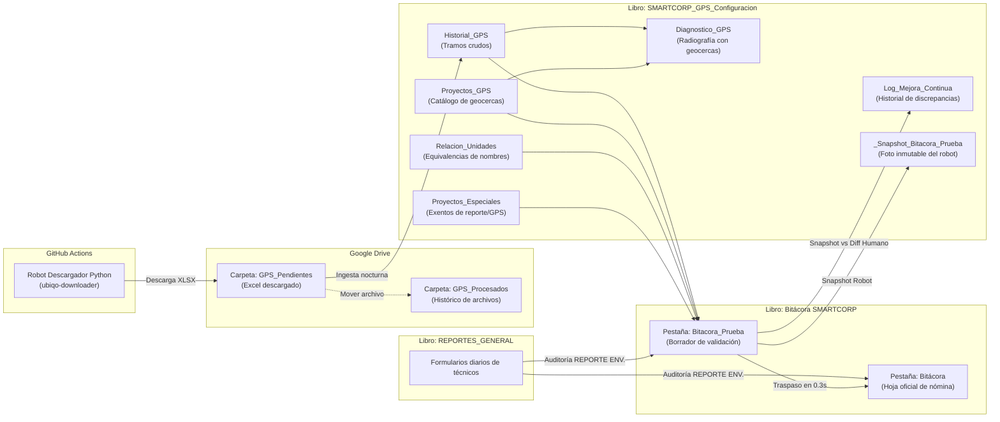
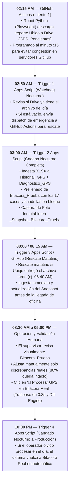
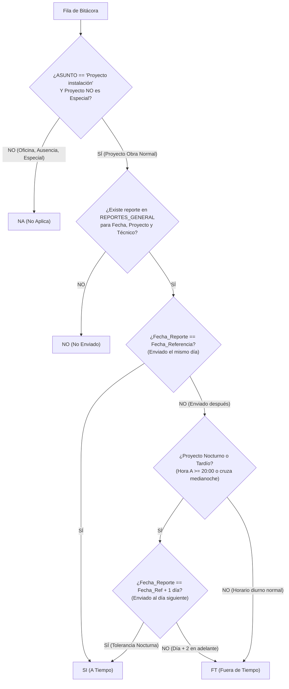
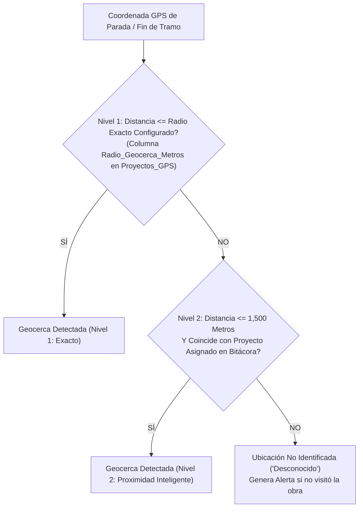
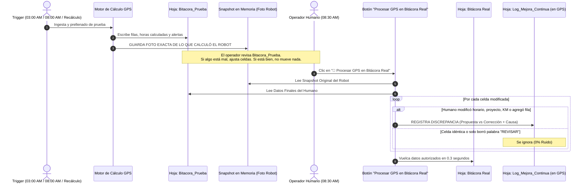

# 📜 Catálogo Maestro de Reglas de Negocio GPS y Reportes Enviados — SMARTCORP
*Versión 6.1 — 28 Septiembre 2026 — Documento de Verdad Absoluta*

> **DOCUMENTO SOP (STANDARD OPERATING PROCEDURE) Y REGLAS DE NEGOCIO DEL SISTEMA SMARTCORP.**  
> Este es el documento rector del sistema automatizado de telemetría, auditoría laboral y validación documental de SMARTCORP.  
> Cualquier modificación al código fuente en Google Apps Script, workflows en GitHub Actions, menús o estructuras de datos debe alinearse estrictamente con lo aquí estipulado.  
> Toda duda o discrepancia operativa entre supervisores, administración, nómina y sistemas se resuelve consultando este documento como la única fuente de verdad técnica y operativa.

---

## 🏗️ 1. FUENTES DE DATOS Y CONTRATOS DE INFORMACIÓN

El sistema opera a través de dos hojas maestras principales de Google Sheets y un repositorio automatizado en GitHub:



### 1.1 Catálogo de Fuentes de Datos

| Libro de Cálculo | Pestaña / Entidad | Rol y Contenido Técnico |
| :--- | :--- | :--- |
| **`Bitácora SMARTCORP`** | `Bitácora` | **Base Maestra de Nómina Oficial.** Contiene fórmulas vivas de SAP (`SAP`), ID (`ID`) y cálculo de jornada (`CÁLCULO HORAS`). Solo se actualiza tras la validación humana. |
| **`Bitácora SMARTCORP`** | `Bitacora_Prueba` | **Borrador de Trabajo Diario.** Aquí el robot escribe todas sus propuestas a las 03:00 AM / 08:00 AM para que el supervisor valide y ajuste si es necesario. |
| **`SMARTCORP_GPS_Configuracion`** | `Historial_GPS` | Repositorio histórico de cada tramo y parada de la flota descargado desde Ubiqo (`Estado: Pendiente / Procesado`). |
| **`SMARTCORP_GPS_Configuracion`** | `Diagnostico_GPS` | Radiografía instantánea con validación de geocercas, tramos y detección de salidas nocturnas. |
| **`SMARTCORP_GPS_Configuracion`** | `Proyectos_GPS` | Catálogo de geocercas de clientes: `PROYECTO`, `LATITUD`, `LONGITUD`, `RADIO_METROS`. |
| **`SMARTCORP_GPS_Configuracion`** | `Relacion_Unidades` | Diccionario de homonimia vehicular entre la plataforma Ubiqo y los nombres de la Bitácora. |
| **`SMARTCORP_GPS_Configuracion`** | `Proyectos_Especiales` | Catálogo de proyectos y conceptos exentos de geocerca o exentos de reporte de instalación. |
| **`SMARTCORP_GPS_Configuracion`** | `Log_Mejora_Continua` | Historial de discrepancias reales entre la propuesta del robot y la edición del humano para calibración progresiva. |
| **`SMARTCORP_GPS_Configuracion`** | `_Snapshot_Bitacora_Prueba` | Hoja técnica oculta que almacena la foto inmutable del cálculo automático previo a la edición humana. |
| **`REPORTES_GENERAL`** | Hoja principal | Formularios de obra enviados por técnicos desde Google Forms/AppSheet para auditar cumplimiento. |

### 1.2 Proyectos Internos Reservados por el Sistema
Los siguientes tres nombres son palabras reservadas del sistema y se consideran proyectos administrativos exentos de geocerca y de reporte de obra:
1. **`SMARTHAUS GASTOS`:** Fila administrativa autogenerada para cubrir tiempos de oficina matriz al inicio o fin de jornada.
2. **`OFICINA`:** Proyectos administrativos internos en matriz.
3. **`SMARTCORP`:** Base central y punto geodésico cero de la flota.

---

## 🔄 2. CICLO DE VIDA DE DATOS Y AUTOMATIZACIÓN DE 24 HORAS

El sistema opera mediante una secuencia temporal estricta de 4 activadores automáticos en la nube más acciones manuales a demanda:



### Detalle de los 4 Triggers Oficiales:

1. **02:15 AM (GitHub Actions — Intento 1):**
   * Configurado en `.github/workflows/run_ubiqo.yml` bajo el cron `15 8 * * 2-6` (08:15 UTC = 02:15 AM México).
   * Se ejecuta al minuto `:15` para evitar la congestión masiva de servidores de GitHub en los minutos `:00`.
   * Descarga el reporte Excel de la flota completa del día anterior desde la plataforma Ubiqo y lo deposita en la carpeta de Google Drive `GPS_Pendientes`.
   * Posee candado anti-duplicados: si el archivo de la fecha ya existe en Drive, aborta para no duplicar datos.

2. **02:50 AM (Trigger 1 Apps Script — Rescate Nocturno):**
   * Función: `auditVerificarDescargaNocturnaUbiqo()`.
   * Revisa si hay algún archivo `.xlsx` en `GPS_Pendientes`. Si la carpeta está vacía (por retraso en Ubiqo o fallo en GitHub), envía una señal de despacho `repository_dispatch` vía API a GitHub Actions para forzar la descarga de emergencia.

3. **03:00 AM (Trigger 2 Apps Script — Cadena Nocturna Completa):**
   * Función: `auditEjecutarCadenaNocturnaAutomatica()`.
   * Ejecuta en secuencia:
     1. **Ingesta:** Lee los archivos de `GPS_Pendientes`, extrae los tramos crudos y paradas acumuladas, los inserta en `Historial_GPS` con estado `"Pendiente"` y traslada el archivo físico a `GPS_Procesados`.
     2. **Diagnóstico:** Genera la radiografía en `Diagnostico_GPS` cruzando los tramos con las geocercas y proyectos programados.
     3. **Prellenado:** Prellena la hoja borrador `Bitacora_Prueba` aplicando los 17 casos de negocio, el acomodo de cuadrillas en bloque y la coordinación de horarios.
     4. **Snapshot:** Guarda la "foto base" de la propuesta del robot en `_Snapshot_Bitacora_Prueba` para el motor de mejora continua.

4. **08:00 AM / 08:15 AM (Trigger 3 Apps Script / GitHub — Rescate Matutino):**
   * GitHub Actions corre el cron de rescate a las 08:15 AM CST (`15 14 * * 2-6` UTC).
   * Apps Script ejecuta `auditVerificarEIngerirPendientesMatutino8AM()` a las 08:00 AM.
   * Si por alguna eventualidad Ubiqo estuvo fuera de servicio en la madrugada pero entregó a las 6:00 o 7:00 AM, este activador detecta el archivo en `GPS_Pendientes`, realiza la ingesta, genera el diagnóstico, prellena `Bitacora_Prueba` y actualiza la foto del snapshot antes de que el personal comience su jornada.

5. **10:00 PM (Trigger 4 Apps Script — Candado Nocturno a Producción):**
   * Función: `auditVerificarYProcesarPendientes10PM()`.
   * Revisa si en `Historial_GPS` quedaron fechas con estado `"Pendiente"`. Si el usuario no dio clic en el botón durante el día (por vacaciones, emergencias o descuido), el sistema efectúa el traspaso masivo de `Bitacora_Prueba` a `Bitácora Real` de forma 100% automática.

---

## 📋 3. MÓDULO — AUDITORÍA DE REPORTES ENVIADOS (`REPORTE ENV.`)

### 3.1 Propósito
Auditar de forma automatizada si los técnicos en campo llenaron en tiempo y forma su reporte de trabajo en el formulario oficial (`REPORTES_GENERAL`), cruzando su asistencia contra las partidas de la `Bitácora`.

### 3.2 Clasificación de Resultados en Columna `REPORTE ENV.`



| Código | Significado | Condición Exacta de Negocio |
| :---: | :--- | :--- |
| **`SI`** | **Reporte enviado a tiempo** | Se cumple **CUALQUIERA** de las dos condiciones:<br>1. **Regla Estándar Diurna:** El reporte se envió el mismo día en que se realizó el trabajo (`Fecha_Reporte == Fecha_Referencia`).<br>2. **Regla de Tolerancia Nocturna / Fin Tardío:** Si el proyecto finalizó a las **20:00 hrs o más tarde**, o si es un **turno nocturno cruzado** (`A < DE`, ej. 18:00 a 01:00 AM), y el reporte fue enviado al **día natural siguiente** (`Fecha_Reporte == Fecha_Referencia + 1 día`). |
| **`FT`** | **Fuera de Tiempo** | Existen reportes registrados en `REPORTES_GENERAL` para ese técnico y proyecto, pero fueron enviados fuera de su plazo permitido:<br>• Para turnos normales: Enviados a partir del día siguiente (`Día + 1` en adelante).<br>• Para turnos nocturnos o tardíos: Enviados a partir del segundo día en adelante (`Día + 2` o más). |
| **`NO`** | **No enviado** | La partida es un `Proyecto instalación` en un proyecto regular de obra, pero **NO se encontró ningún reporte** enviado por ese técnico para ese proyecto en esa fecha de trabajo. |
| **`NA`** | **No Aplica** | Se asigna obligatoriamente si se cumple **CUALQUIERA** de los siguientes supuestos:<br>1. El `ASUNTO` en la Bitácora **NO** es igual a `"Proyecto instalación"` (ej. `Oficina`, `SMARTHAUS GASTOS`, `Traslado`, `Capacitación`, `Permiso`, `Incapacidad`, `Falta`, etc.).<br>2. El proyecto está registrado en la pestaña `Proyectos_Especiales` (exento de reporte por acuerdo comercial).<br>3. El proyecto es un proyecto interno del sistema (`SMARTHAUS GASTOS`, `OFICINA`, `SMARTCORP`). |

### 3.3 Regla de Tolerancia Nocturna y Fin Tardío (Fórmula de Plazo Justo)
Un técnico que concluye su jornada a las 22:00 hrs o a la 01:00 AM no puede ser penalizado con `FT` por no enviar el formulario antes de las 23:59 del mismo día.
* **Condición de activación:**  
  $$\text{Hora Fin } (A) \ge 20.0 \quad \lor \quad \text{Hora Entrada } \ge 20.0 \quad \lor \quad A < DE \text{ (Turno cruzado)}$$
* **Evaluación temporal:**
  $$\Delta \text{Días} = \text{Fecha\_Reporte} - \text{Fecha\_Referencia}$$
  $$\text{Resultado} = \begin{cases} 
  \mathbf{SI} & \text{si } \Delta \text{Días} = 0 \\ 
  \mathbf{SI} & \text{si } \Delta \text{Días} = 1 \ \land \ \text{esTardioONocturno} \\ 
  \mathbf{FT} & \text{si } \Delta \text{Días} \ge 1 \ \land \ \neg\text{esTardioONocturno} \\ 
  \mathbf{FT} & \text{si } \Delta \text{Días} \ge 2 \ \land \ \text{esTardioONocturno} 
  \end{cases}$$

### 3.4 Criterio Triclave de Coincidencia (Match Engine)
Para vincular una fila de la Bitácora con un formulario de `REPORTES_GENERAL`, el motor evalúa:
1. **Fecha de Trabajo:** $\text{Bitácora.FECHA} \equiv \text{REPORTES\_GENERAL.Fecha\_Referencia}$ (ambas en formato `DD/MM/YYYY`).
2. **Proyecto Normalizado:** Comparación canónica sin acentos, mayúsculas ni dobles espacios:  
   `auditReporteNormalizar(Bitácora.PROYECTO) === auditReporteNormalizar(REPORTES_GENERAL.NombreProyecto)`
3. **Nombre del Técnico en Cuadrilla:** La columna `Equipo_Trabajo_Manual` de `REPORTES_GENERAL` puede contener múltiples personas separadas por comas, diagonales o la conjunción " y " (ej. *"Luis Rodríguez / Eduardo Ramírez"*). El sistema tokeniza la celda y evalúa si el nombre del técnico de la Bitácora coincide con alguno de los participantes.

---

## 🚗 4. MÓDULO — AUDITORÍA GPS, TELEMETRÍA Y GEOCERCAS

### 4.1 Algoritmo de Detección de Geocercas (2 Niveles de Tolerancia)
Para determinar si un vehículo estuvo físicamente en un proyecto o en la oficina matriz, se calcula la distancia geodésica mediante la fórmula de Haversine:



* **Nivel 1 (Radio Exacto Configurado):** Si la distancia es menor o igual al radio especificado en `Proyectos_GPS` (por defecto 100 metros si la celda está vacía), la geocerca se valida al 100%.
* **Nivel 2 (Proximidad Inteligente — 1,500 Metros):** Si el vehículo se estacionó fuera del perímetro oficial (estacionamientos externos de parques industriales, casetas de acceso alejadas o plantas de gran extensión), el sistema amplía la tolerancia hasta **1,500 metros** siempre que la geocerca coincida con el proyecto asignado a esa cuadrilla en la Bitácora.
* **Geocerca de Oficina Matriz (SMARTCORP):** Coordenadas fijas `Lat: 20.6191, Lon: -100.4079` con un radio estricto de **250 metros**.

---

### 4.2 Matriz Resumen de los 17 Casos Operativos de Bitácora

A continuación se presenta la tabla sinóptica que define qué columnas se llenan y cuáles se suprimen según el caso:

| Caso | Tipo de Jornada | Horario Base | Salida Oficina | Llegada Proy | Salida Proy | Entrada Oficina | KM / Recorrido / Paradas | Rev / Observaciones |
| :---: | :--- | :---: | :---: | :---: | :---: | :---: | :---: | :---: | :---: |
| **1** | **Proyecto Único Regular** (Día estándar en obra) | `08:00 - 18:00` | Hora real | Hora real | Hora real | Hora real | Métricas completas | Vacío si visitó geocerca |
| **2** | **Inicio Tardío** (Sale de oficina después de las 09:00 AM) | Calculado $\ge 09:00$ | **VACÍO** ➖ | **VACÍO** ➖ | Hora real | Hora real | Métricas del proyecto | Genera `SMARTHAUS GASTOS` previo |
| **3** | **Retorno Temprano** (Vuelve a oficina antes de las 17:00) | `08:00` - Calculado | Hora real | Hora real | **VACÍO** ➖ | **VACÍO** ➖ | Métricas del proyecto | Genera `SMARTHAUS GASTOS` posterior |
| **4** | **Horas Extra Regulares** (Retorno entre 19:00 y 21:00) | `08:00` - Real redondeado | Hora real | Hora real | Hora real | Hora real | Métricas completas | Calcula Horas Extra ($leDec - 18.0$) |
| **5** | **Horas Extra Extremas** (Retorno después de las 21:00) | `08:00` - Real redondeado | Hora real | Hora real | Hora real | Hora real | Métricas completas | Horas extra + Alerta nocturna |
| **6** | **Primer Proyecto de un Multi-Proyecto** | `08:00` - Salida P1 | Hora real | Hora real | **VACÍO** ➖ | **VACÍO** ➖ | Métricas tramo P1 | Sin horas de entrada a oficina |
| **7** | **Proyecto Intermedio** (Proyecto 2 de 3) | Fin P1 - Inicio P3 | **VACÍO** ➖ | **VACÍO** ➖ | **VACÍO** ➖ | **VACÍO** ➖ | Métricas tramo intermedio | Horas exteriores vacías |
| **8** | **Último Proyecto de un Multi-Proyecto** | Fin P(n-1) - `18:00` | **VACÍO** ➖ | **VACÍO** ➖ | Hora real | Hora real | Métricas retorno | Sin horas de salida de oficina |
| **9** | **Proyecto Especial / Foráneo Exento** | `08:00 - 18:00` | Hora real | **VACÍO** ➖ | **VACÍO** ➖ | Hora real | KM y tiempos reales | `NA` en reporte, sin alerta geocerca |
| **10** | **Fila Administrativa `SMARTHAUS GASTOS`** | Horas calculadas | **VACÍO** ➖ | **VACÍO** ➖ | **VACÍO** ➖ | **VACÍO** ➖ | **VACÍO** ➖ | `NA` en reporte, asunto `Oficina` |
| **11** | **Vehículo No Visitó Geocerca del Proyecto** | `08:00 - 18:00` | Hora real | **VACÍO** ➖ | **VACÍO** ➖ | Hora real | KM y tiempos reales | `REV = REVISAR`, alerta geocerca |
| **12** | **Proyecto Sin Geocerca en Catálogo** | `08:00 - 18:00` | Hora real | **VACÍO** ➖ | **VACÍO** ➖ | Hora real | KM y tiempos reales | `REV = REVISAR`, falta catálogo |
| **13** | **Regresos Múltiples al Mismo Proyecto** | `08:00 - 18:00` | Primer salida | Primer llegada | Última salida | Última entrada | Métricas acumuladas | Columna `REGRESOS` = N vueltas |
| **14** | **Cuadrilla Compartida en Misma Unidad** | Según horario obra | Sincronizado | Sincronizado | Sincronizado | Sincronizado | Métricas idénticas | Acomodo en bloque contiguo |
| **15** | **Ausencia / Falta / Incapacidad / Vacaciones** | `08:00 - 18:00` | **VACÍO** ➖ | **VACÍO** ➖ | **VACÍO** ➖ | **VACÍO** ➖ | **VACÍO** ➖ | Sin GPS, preserva ausencia |
| **16** | **Unidad Administrativa / NA** (Sin GPS) | `08:00 - 18:00` | **VACÍO** ➖ | **VACÍO** ➖ | **VACÍO** ➖ | **VACÍO** ➖ | **VACÍO** ➖ | `REV = REVISAR`, partida sin unidad |
| **17** | **Salida Nocturna No Registrada** (Movimiento $\ge$ 18:15) | Horario diurno | Horas diurnas | Horas diurnas | Horas diurnas | Horas diurnas | Solo tramos diurnos | `REV = REVISAR`, Alerta nocturna |

---

### 4.3 Desglose Exhaustivo Caso por Caso (Catálogo Operativo del Caso 1 al 17)

A continuación se detalla cada uno de los 17 casos con su contexto operativo, lógica computacional, columnas afectadas, tratamiento de alertas y ejemplos claros de entrada y salida:

#### 🔹 CASO 1: Proyecto Único Regular (Jornada Estándar en Campo)
* **Definición Operativa:** El técnico o cuadrilla tiene asignado un solo proyecto de instalación en el día. El vehículo sale de la oficina matriz SMARTCORP entre las 08:00 y las 09:00 AM, llega a la geocerca del cliente, realiza la instalación y regresa a la oficina matriz entre las 17:00 y las 18:00 hrs.
* **Comportamiento de Columnas:**
  - `DE`: Se establece en `08:00`.
  - `A`: Se establece en `18:00`.
  - `HORA DE SALIDA`: Hora real en que la unidad cruzó el radio de salida de SMARTCORP (ej. `08:35:10`).
  - `HORA LLEG PROY`: Hora real en que la unidad ingresó a la geocerca del cliente (ej. `09:22:40`).
  - `HORA SAL PROY`: Hora real en que la unidad abandonó la geocerca del cliente (ej. `16:55:12`).
  - `HORA DE ENTRADA`: Hora real de regreso al patio de SMARTCORP (ej. `17:42:05`).
  - `KM`, `TIEMPO RECORRIDO`, `PARADAS`, `TIEMPO DE PARADAS`: Valores acumulados de la telemetría del día.
  - `REGRESOS`: `0` (o vacío si no hubo reingresos).
  - `REV`: Vacío (`""`), no genera advertencia si la geocerca fue validada.
  - `REPORTE ENV.`: Se audita cruzando contra `REPORTES_GENERAL` (`SI`, `FT`, o `NO`).

#### 🔹 CASO 2: Inicio Tardío (Salida de Oficina Posterior a las 09:00 AM)
* **Definición Operativa:** La cuadrilla no sale a carretera a primera hora porque estuvo realizando preparativos en matriz, cargando material pesado, en reunión técnica o en taller. La primera salida de la oficina ocurre después de las 09:00 AM (ej. 10:15 AM).
* **Lógica Computacional:**
  - El robot detecta que el primer movimiento fuera de la geocerca matriz ocurrió a las 10:15 AM.
  - Redondea la hora de corte a cuartos de hora: `10:15`.
  - Genera automáticamente una fila previa de `SMARTHAUS GASTOS` con horario `08:00` a `10:15` y asunto `Oficina`.
  - En la fila del proyecto de campo: fija `DE = 10:15` y `A = 18:00`.
  - **Regla de Supresión Simétrica:** Dado que el técnico inició trabajando en oficina, el proyecto de obra **NO es la salida inicial del día**. Por lo tanto:
    - **`HORA DE SALIDA = ""` (VACÍA)**.
    - **`HORA LLEG PROY = ""` (VACÍA)**.
    - `HORA SAL PROY` y `HORA DE ENTRADA`: Se escriben con sus horas reales de retorno a matriz.
  - `OBSERVACIONES`: Se indica el inicio tardío en la fila administrativa.

#### 🔹 CASO 3: Retorno Temprano (Regreso a Oficina Previo a las 17:00 hrs)
* **Definición Operativa:** La instalación en campo concluyó antes de lo habitual o el cliente liberó a la cuadrilla temprano. El vehículo regresa al patio de SMARTCORP antes de las 17:00 hrs (ej. 15:40 hrs). El personal continúa laborando el resto de su jornada en oficina.
* **Lógica Computacional:**
  - El robot detecta la entrada final a SMARTCORP a las 15:40 hrs. Redondea al cuarto de hora hacia arriba: `15:45`.
  - En la fila del proyecto de campo: fija `DE = 08:00` y corta `A = 15:45`.
  - **Regla de Supresión Simétrica:** Dado que el técnico concluye su jornada laborando en oficina, el proyecto de obra **NO es el regreso final del día**. Por lo tanto:
    - `HORA DE SALIDA` y `HORA LLEG PROY`: Se escriben con las horas reales de salida de matriz y llegada a obra.
    - **`HORA SAL PROY = ""` (VACÍA)**.
    - **`HORA DE ENTRADA = ""` (VACÍA)**.
  - Genera automáticamente una fila posterior de `SMARTHAUS GASTOS` con horario `15:45` a `18:00` y asunto `Oficina`.

#### 🔹 CASO 4: Horas Extra Regulares (Retorno a Matriz entre 19:00 y 21:00 hrs)
* **Definición Operativa:** La cuadrilla enfrentó demoras en obra o tráfico en carretera, regresando al patio de SMARTCORP entre las 19:00 y las 21:00 hrs (ej. retorno a las 20:18 hrs).
* **Lógica Computacional:**
  - El sistema concede tolerancia de traslado hasta las 18:00 hrs. Toda permanencia vehicular posterior a las 18:00 hrs computa para tiempo extraordinario.
  - Redondea la hora de arribo a cuartos de hora: $20:18 \to 20:30$ ($20.5\text{ hrs decimales}$).
  - En el proyecto de campo: fija `DE = 08:00` y fija `A = 20:30`.
  - **Cálculo de Horas Extra:**  
    $$\text{Horas Extra} = \text{round}_1(20.5 - 18.0) = \mathbf{2.5\text{ hrs}}$$
  - Se escriben las 4 columnas de horario con las horas reales de la telemetría.
  - **Tolerancia Nocturna de Reporte:** Dado que $A \ge 20:00$, la cuadrilla cuenta con autorización para enviar su reporte al día siguiente (`Día + 1`) recibiendo estatus `SI`.

#### 🔹 CASO 5: Horas Extra Extremas / Prolongadas (Retorno Posterior a las 21:00 hrs)
* **Definición Operativa:** Obras complejas, cortes foráneos o rescates donde la unidad regresa a SMARTCORP muy tarde en la noche o de madrugada (ej. 23:45 hrs o 01:30 AM del día siguiente).
* **Lógica Computacional:**
  - Redondea el fin de jornada al cuarto de hora superior.
  - Calcula `HORAS EXTRA` totales respecto a la base de las 18:00 hrs.
  - Fija `A` con la hora real nocturna redondeada.
  - Se genera una alerta en `OBSERVACIONES`: `[GPS] Horas extra prolongadas detectadas (retorno XX:XX). Validar con supervisor.`
  - Aplica incondicionalmente la regla de Tolerancia Nocturna (`Día + 1`) en la columna `REPORTE ENV.`.

#### 🔹 CASO 6: Primer Proyecto de una Jornada Multi-Proyecto
* **Definición Operativa:** El técnico tiene asignados 2 o más proyectos en el día. Este caso rige el primer proyecto de la secuencia matutina.
* **Lógica Computacional:**
  - `DE`: Se fija en `08:00`.
  - `A`: Se fija en la hora de corte con el segundo proyecto (calculada mediante retorno a oficina o punto medio midpoint).
  - `HORA DE SALIDA`: Hora real en que la unidad abandonó SMARTCORP por la mañana.
  - `HORA LLEG PROY`: Hora real en que ingresó a la geocerca del Proyecto 1.
  - **`HORA SAL PROY = ""` (VACÍA)** y **`HORA DE ENTRADA = ""` (VACÍA)**: Permanecen estrictamente vacías porque el técnico no regresa a SMARTCORP a concluir su día, sino que continúa hacia otra obra.
  - Los kilómetros y tiempos corresponden al trayecto del Proyecto 1.

#### 🔹 CASO 7: Proyecto Intermedio en Jornadas Multi-Proyecto
* **Definición Operativa:** Aplica a obras intermedias (ej. el proyecto 2 en una jornada de 3 proyectos). El técnico viaja de un cliente a otro durante el mediodía sin pasar por oficina matriz.
* **Lógica Computacional:**
  - `DE`: Hora de corte final del proyecto anterior.
  - `A`: Hora de corte inicial del proyecto siguiente.
  - **Las 4 columnas de horas exteriores quedan estrictamente VACÍAS (`""`)**:
    - `HORA DE SALIDA = ""`
    - `HORA LLEG PROY = ""`
    - `HORA SAL PROY = ""`
    - `HORA DE ENTRADA = ""`
  - `KM` y `TIEMPO RECORRIDO`: Si fue un traslado directo de obra a obra, la distancia y tiempo del viaje se dividen equitativamente (50% al proyecto anterior y 50% al proyecto intermedio).
  - `REV`: Vacío si el vehículo fue detectado dentro de la geocerca intermedia.

#### 🔹 CASO 8: Último Proyecto de una Jornada Multi-Proyecto
* **Definición Operativa:** Aplica al proyecto que cierra la jornada en campo tras haber visitado obras previas. Concluye con el retorno final a SMARTCORP.
* **Lógica Computacional:**
  - `DE`: Hora de corte final del proyecto anterior.
  - `A`: `18:00` (o la hora real nocturna redondeada si hubo horas extra).
  - **`HORA DE SALIDA = ""` (VACÍA)** y **`HORA LLEG PROY = ""` (VACÍA)**: Permanecen estrictamente vacías porque la unidad no salió de SMARTCORP para esta obra, venía de otro proyecto.
  - `HORA SAL PROY`: Hora real en que abandonó la geocerca de este último cliente.
  - `HORA DE ENTRADA`: Hora real de regreso definitivo a la oficina matriz SMARTCORP.
  - `KM` y tiempos corresponden al trayecto final de regreso a base.

#### 🔹 CASO 9: Proyecto Especial / Foráneo Exento (Pestaña `Proyectos_Especiales`)
* **Definición Operativa:** Trabajos de mantenimiento preventivo foráneo, custodias, eventos especiales o partidas con clientes que no requieren reporte técnico ni validación de geocerca fija (ej. `"INT QRO MTTO PERSONAL 2605"`).
* **Lógica Computacional:**
  - `DE = 08:00` y `A = 18:00` (o según su posición en el día).
  - **Exención Total de Geocerca:** `HORA LLEG PROY = ""` y `HORA SAL PROY = ""` (permanecen vacías, el sistema no exige geocerca de cliente).
  - `HORA DE SALIDA` y `HORA DE ENTRADA`: Se escriben con las horas reales del vehículo si hubo movimiento.
  - `KM` y `TIEMPO RECORRIDO`: Se computan los kilómetros reales recorridos por la unidad.
  - `REV`: Limpio (`""`), **nunca genera alertas por falta de visita a geocerca**.
  - `REPORTE ENV.`: Se clasifica obligatoriamente como **`NA` (No Aplica)**.

#### 🔹 CASO 10: Fila Administrativa de Oficina (`SMARTHAUS GASTOS`)
* **Definición Operativa:** Partida interna de oficina matriz insertada por el sistema para cubrir espacios donde la unidad no estuvo en carretera (antes de salir a obra o después de regresar).
* **Lógica Computacional:**
  - `PROYECTO`: `"SMARTHAUS GASTOS"`.
  - `ASUNTO`: `"Oficina"` (o `"smarthaus gastos"`).
  - `DE` y `A`: Horas de inicio y fin del bloque de oficina (ej. `08:00 a 10:00` o `16:00 a 18:00`).
  - **Las 4 horas de enlace quedan estrictamente VACÍAS (`""`)**:
    - `HORA DE SALIDA = ""`
    - `HORA LLEG PROY = ""`
    - `HORA SAL PROY = ""`
    - `HORA DE ENTRADA = ""`
  - **Métricas de Telemetría VACÍAS**: `KM = ""`, `TIEMPO RECORRIDO = ""`, `PARADAS = ""`, `REGRESOS = ""`.
  - `REPORTE ENV.`: Se asigna automáticamente **`NA`**.

#### 🔹 CASO 11: Proyecto Normal Sin Visita a Geocerca (`sinGeocerca = true` / GPS Fantasma)
* **Definición Operativa:** El vehículo registró actividad de kilometraje durante el día, pero ninguna de sus paradas o tramos coincidió dentro del radio exacto ni en la proximidad de 1,500m del cliente especificado en la Bitácora.
* **Lógica Computacional:**
  - Para evitar inventar horas falsas de arribo o generar inconsistencias contables:
    - **`HORA LLEG PROY = ""` (VACÍA)**.
    - **`HORA SAL PROY = ""` (VACÍA)**.
  - `HORA DE SALIDA` y `HORA DE ENTRADA`: Conservan las horas reales de salida y entrada a SMARTCORP.
  - `KM` y `TIEMPO RECORRIDO`: Conservan los kilómetros totales registrados por la unidad en la jornada.
  - `REV`: Se marca obligatoriamente con la etiqueta **`REVISAR`**.
  - `OBSERVACIONES`: Se concatena la advertencia:  
    `[GPS] REVISAR: El vehículo no visitó la geocerca configurada para este proyecto.`

#### 🔹 CASO 12: Proyecto Sin Geocerca en Catálogo (`Proyectos_GPS`)
* **Definición Operativa:** El nombre del proyecto capturado en la Bitácora no existe en la hoja `Proyectos_GPS`, o sus celdas de latitud y longitud están vacías.
* **Lógica Computacional:**
  - Ante la imposibilidad matemática de calcular la distancia geodésica:
    - **`HORA LLEG PROY = ""` (VACÍA)**.
    - **`HORA SAL PROY = ""` (VACÍA)**.
  - Conserva `HORA DE SALIDA`, `HORA DE ENTRADA`, `KM` y tiempos de la unidad.
  - `REV`: Se marca como **`REVISAR`**.
  - `OBSERVACIONES`: `[GPS] REVISAR: Proyecto sin geocerca registrada en catálogo Proyectos_GPS.`

#### 🔹 CASO 13: Retornos Múltiples al Mismo Proyecto (Columna `REGRESOS`)
* **Definición Operativa:** La cuadrilla sale a una obra, regresa a la oficina matriz a cargar más insumos, cable o herramienta especializada, y vuelve a trasladarse a la misma obra en el mismo día.
* **Lógica Computacional:**
  - El sistema detecta el patrón: $\text{SMARTCORP} \to \text{Obra A} \to \text{SMARTCORP} \to \text{Obra A} \to \text{SMARTCORP}$.
  - La columna **`REGRESOS`** contabiliza exactamente el número de reingresos ($1, 2, \dots$).
  - `HORA DE SALIDA`: Primer salida registrada de SMARTCORP en la mañana.
  - `HORA LLEG PROY`: Primer llegada registrada a la geocerca de la obra.
  - `HORA SAL PROY`: Última salida registrada de la geocerca de la obra hacia matriz.
  - `HORA DE ENTRADA`: Último retorno definitivo a SMARTCORP.
  - `KM` y `TIEMPO RECORRIDO`: Suma acumulada de todos los tramos de ida y vuelta.

#### 🔹 CASO 14: Cuadrilla que Viaja en la Misma Unidad (Acomodo en Bloque Contiguo)
* **Definición Operativa:** Dos o más colaboradores (ej. Líder de Cuadrilla, Técnico Instalador y Chofer) viajan juntos en la misma camioneta para ejecutar los mismos proyectos.
* **Lógica Computacional:**
  - El sistema identifica que las filas comparten la misma fecha y la misma `UNIDAD`.
  - Mantiene las filas del proyecto de obra contiguas entre sí.
  - Si la cuadrilla tuvo inicio tardío, inserta las filas administrativas `SMARTHAUS GASTOS` de todos los miembros **juntas arriba del proyecto**.
  - Si la cuadrilla tuvo retorno temprano, inserta las filas administrativas `SMARTHAUS GASTOS` **juntas abajo del proyecto**.
  - Todas las métricas de kilómetros, horas de geocerca y paradas se sincronizan de forma idéntica para todos los integrantes.

#### 🔹 CASO 15: Ausencia Justificada, Incapacidad IMSS, Vacaciones y Falta
* **Definición Operativa:** La fila de la Bitácora corresponde a un colaborador que no laboró en campo por enfermedad, vacaciones, descanso, falta o permiso especial.
* **Lógica Computacional:**
  - El sistema reconoce palabras clave en `PROYECTO` o `ASUNTO`: `falta`, `incapacidad`, `vacaciones`, `permiso`, `descanso`, `suspension`.
  - **Protección Incondicional de Nómina:** Fija estrictamente `DE = 08:00` y `A = 18:00`.
  - **Cero Telemetría GPS:** Todas las columnas de telemetría quedan en blanco:
    - `HORA DE SALIDA = ""`
    - `HORA LLEG PROY = ""`
    - `HORA SAL PROY = ""`
    - `HORA DE ENTRADA = ""`
    - `KM = ""`
    - `TIEMPO RECORRIDO = ""`
    - `PARADAS = ""`
    - `REGRESOS = ""`
  - `REV`: Limpio (`""`). **Jamás genera alertas de geocerca ni de revisión**.
  - `REPORTE ENV.`: Se asigna obligatoriamente **`NA`**.

#### 🔹 CASO 16: Partida sin Unidad Asignada (`UNIDAD = NA` o Celda Vacía)
* **Definición Operativa:** La fila corresponde a un proyecto de obra (`Proyecto instalación`), pero la columna `UNIDAD` está vacía o dice `"NA"`. El robot no tiene forma de saber en qué vehículo viajó el colaborador.
* **Lógica Computacional:**
  - Fija horario base `DE = 08:00` y `A = 18:00`.
  - No puede asignar telemetría GPS (permanecen vacías todas las columnas de horas exteriores y kilómetros).
  - `REV`: Se marca obligatoriamente con **`REVISAR`**.
  - `OBSERVACIONES`: Concatena la alerta:  
    `[GPS] REVISAR: Esta partida no tiene unidad asignada.`

#### 🔹 CASO 17: Candado Diurno 18:00 hrs y Salida Nocturna Huérfana (`⚠️ [NOCTURNO PENDIENTE]`)
* **Definición Operativa:** La unidad realizó su jornada diurna normal y retornó a la oficina matriz SMARTCORP antes de las 18:00 hrs (ej. a las 17:15 hrs). Sin embargo, el dispositivo GPS registra que la camioneta volvió a salir del patio después de las 18:00 hrs (ej. a las 20:30 o 22:00 hrs) y ese viaje nocturno no está capturado en la Bitácora.
* **Lógica Computacional:**
  - El sistema corta la fila diurna respetando estrictamente su llegada de las 17:15 hrs, evitando contaminar la jornada diurna con horas extras falsas.
  - Al detectar tramos huérfanos posteriores a las 18:00 hrs, coloca la bandera de revisión:
  - `REV`: Se marca con **`REVISAR`**.
  - `OBSERVACIONES`: Concatena la alerta:  
    `⚠️ [NOCTURNO PENDIENTE]: Se detectó movimiento vehicular posterior al cierre de oficina (XX:XX hrs). Validar si existió turno nocturno o emergencia no agendada.`
  - El operador humano debe verificar si existió una guardia o servicio nocturno para agregar manualmente la fila correspondiente o retirar la alerta.

---

### 4.4 Regla de Coordinación y Supresión Simétrica de Horas con Oficina al Inicio o Fin

Cuando una jornada combina trabajo administrativo en oficina matriz (`SMARTHAUS GASTOS`) y trabajo en campo, los horarios exteriores se coordinan de forma simétrica para evitar traslapes o interpretaciones erróneas de trayectos:

```mermaid
graph TD
    subgraph CasoA["Escenario A: Oficina al Inicio (Inicio Tardío)"]
        A1["Fila 1: SMARTHAUS GASTOS (08:00 a 10:00)"]
        A2["Fila 2: PROYECTO CAMPO (10:00 a 18:00)"]
        A1 -.->|Cuenta como Proyecto 1| A2
        A2 -.->|Hora Salida: VACÍA<br/>Hora Lleg Proy: VACÍA| A3["Sal Proy y Entrada: Con horas reales"]
    end
    
    subgraph CasoB["Escenario B: Oficina al Final (Retorno Temprano)"]
        B1["Fila 1: PROYECTO CAMPO (08:00 a 16:00)"]
        B2["Fila 2: SMARTHAUS GASTOS (16:00 a 18:00)"]
        B1 -.->|Salida y Lleg Proy: Con horas reales| B3["Hora Sal Proy: VACÍA<br/>Hora Entrada: VACÍA"]
        B3 -.->|Cuenta como Proyecto Final| B2
    end
```



1. **Oficina al Inicio (Fila administrativa previa):**
   * El proyecto en campo **NO es la primera salida de la mañana** (el técnico comenzó trabajando en oficina matriz).
   * **Regla estricta:** En el proyecto de campo **`HORA DE SALIDA`** y **`HORA LLEG PROY`** deben quedar **completamente vacías (`""`)**. Su hora `DE` inicia en el momento exacto en que terminó la oficina (ej. `10:00`).
2. **Oficina al Final (Fila administrativa posterior):**
   * El proyecto en campo **NO es el regreso final del día** (el técnico retornó temprano y concluyó su jornada laborando en oficina matriz).
   * **Regla estricta:** En el proyecto de campo **`HORA SAL PROY`** y **`HORA DE ENTRADA`** deben quedar **completamente vacías (`""`)**. Su hora `A` corta en el momento exacto en que llegó a matriz (ej. `16:00`).
3. **Oficina al Inicio Y al Final:**
   * El proyecto de campo es un tramo intermedio $\rightarrow$ **Las 4 horas exteriores permanecen vacías (`""`)**.
4. **Proyecto Único Regular (Sin oficina):**
   * Conserva las 4 horas completas (`HORA DE SALIDA`, `HORA LLEG PROY`, `HORA SAL PROY`, `HORA DE ENTRADA`).

---

### 4.5 Inserción de Filas Administrativas en Bloque por Cuadrilla

Para evitar desorden visual en la Bitácora, cuando dos o más técnicos asisten al mismo proyecto en el mismo vehículo, las filas automáticas de `SMARTHAUS GASTOS` se insertan **agrupadas por bloque de cuadrilla**:

```
ESTRUCTURA DE LECTURA CRONOLÓGICA POR BLOQUE:

[Caso Inicio Tardío: Oficina de 08:00 a 10:00]
Fila 10: Juan Pérez   | SMARTHAUS GASTOS | 08:00 a 10:00 | Oficina
Fila 11: Pedro Gómez  | SMARTHAUS GASTOS | 08:00 a 10:00 | Oficina
Fila 12: Juan Pérez   | OBRA AMAZON      | 10:00 a 18:00 | Proyecto instalación
Fila 13: Pedro Gómez  | OBRA AMAZON      | 10:00 a 18:00 | Proyecto instalación

[Caso Retorno Temprano: Oficina de 16:00 a 18:00]
Fila 20: Juan Pérez   | OBRA MERCADO LIBRE | 08:00 a 16:00 | Proyecto instalación
Fila 21: Pedro Gómez  | OBRA MERCADO LIBRE | 08:00 a 16:00 | Proyecto instalación
Fila 22: Juan Pérez   | SMARTHAUS GASTOS   | 16:00 a 18:00 | Oficina
Fila 23: Pedro Gómez  | SMARTHAUS GASTOS   | 16:00 a 18:00 | Oficina
```

* **Algoritmo de Inserción Inversa (Bottom-to-Top):** Para no alterar los índices de fila en memoria al insertar filas en la hoja de cálculo, el motor ordena las inserciones desde la fila de mayor índice hacia la de menor índice, garantizando que ninguna coordenada de celda se desplace.

---

### 4.6 Candado de Corte Diurno (18:00 hrs) y Detección de Viajes Nocturnos Huérfanos

Si una unidad automotriz regresa a la oficina matriz antes de las 18:00 hrs (por ejemplo a las 17:31 hrs) y posteriormente la telemetría GPS registra nuevos tramos en movimiento después de las 18:00 hrs:
1. **El sistema NO extiende la jornada diurna artificialmente:** La fila diurna corta en su horario real de llegada antes de las 18:00 hrs.
2. **Generación de Alerta Nocturna:** El sistema detecta que existen tramos en horario nocturno no cubiertos por ninguna fila de la Bitácora y emite la alerta preventiva en `REV = REVISAR`:
   `⚠️ [NOCTURNO PENDIENTE]: Se detectó movimiento vehicular posterior al cierre de oficina (XX:XX hrs). Validar si existió turno nocturno o emergencia.`
3. **Acción Operativa:** El supervisor valida si existió un turno nocturno de emergencia. De ser así, agrega manualmente la fila en `Bitacora_Prueba` con el horario nocturno real (ej. `21:00 a 02:00`), permitiendo que el sistema calcule los tramos nocturnos correspondientes.

---

### 4.7 Regla Estricta para Faltas, Incapacidades y Vacaciones

Cualquier registro en la Bitácora que represente una ausencia laboral recibe un tratamiento incondicional de protección:
* **Identificación:** La columna `ASUNTO` o `PROYECTO` contiene términos como: `falta`, `incapacidad`, `vacaciones`, `permiso`, `descanso`, `suspension`.
* **Horario Obligatorio:** Se fijan de manera estricta las horas `DE = 08:00` y `A = 18:00`.
* **Protección de Telemetría:** El sistema **NUNCA** escribe kilómetros, horas de geocerca, paradas ni tiempos en filas de ausencia.
* **Exención de Reporte:** La columna `REPORTE ENV.` se califica automáticamente como **`NA`**.

---

## 📈 5. MÓDULO — MOTOR DE MEJORA CONTINUA Y APRENDIZAJE AUTÓNOMO

### 5.1 Propósito y Filosofía
Hacer que el sistema de auditorías de SMARTCORP sea cada vez más autónomo y reduzca progresivamente la necesidad de revisión humana. En lugar de registrar todas las alertas del robot (donde el 80% son descartadas como normales sin requerir acción), el sistema implementa un **Detector de Diferencias (Diff Engine)** que registra **exclusivamente las filas donde el operador humano tuvo que realizar una corrección real**.



### 5.2 Estructura del Libro y Pestaña `Log_Mejora_Continua`
* **Ubicación:** Libro de telemetría y configuración **`SMARTCORP_GPS_Configuracion`**.
* **Columnas del Log:**
  1. `Timestamp_Aprobacion`: Fecha y hora exacta de la autorización humana (`YYYY-MM-DD HH:MM:SS`).
  2. `Fecha_Jornada`: Fecha auditada (`DD/MM/YYYY`).
  3. `Tecnico`: Nombre completo del técnico.
  4. `Unidad`: Camioneta asignada.
  5. `Proyecto`: Proyecto en Bitácora.
  6. `Campo_Modificado`: Columna que el humano alteró (`DE`, `A`, `KM`, `HORA LLEG PROY`, `HORA SAL PROY`, `PROYECTO`, `UNIDAD`, `FILA_NUEVA`).
  7. `Valor_Propuesto_Robot`: Lo que el sistema calculó a las 3:00 AM / 8:00 AM.
  8. `Valor_Final_Humano`: Lo que el humano capturó tras su validación.
  9. `Causa_Deducida`: Clasificación automática generada por el sistema.
  10. `Accion_Recomendada`: Sugerencia técnica para que el robot aprenda y no vuelva a requerir intervención.

### 5.3 Clasificación Automática de Causas y Reglas de Aprendizaje

| Causa Deducida | Condición Técnica Detectada | Acción Recomendada de Aprendizaje |
| :--- | :--- | :--- |
| **Geocerca Descalibrada / Reducida** | El robot dejó `HORA LLEG PROY` vacía por no detectar geocerca, y el humano capturó una hora manual. | **Ampliar el radio** en `Proyectos_GPS` de ese cliente en $+250\text{ m}$ o verificar caseta de acceso. |
| **Corrección de Horario de Salida** | El robot asignó inicio tardío (`DE = 10:00`) y el humano lo regresó a `08:00`. | Analizar si el vehículo estuvo en taller o carga de material antes de las 8:00 AM. |
| **Turno Nocturno Agregado** | El humano insertó una fila con horario $\ge$ 18:00 para una unidad con alerta nocturna. | Configurar guardias nocturnas en la agenda previa para que el robot las reconozca en automático. |
| **Ajuste de Kilometraje Manual** | La celda `KM` fue sobreescrita por el supervisor. | Verificar si el dispositivo GPS perdió cobertura o si la unidad tomó rutas alternas sin señal. |
| **Cambio de Unidad en Campo** | La columna `UNIDAD` fue modificada por el operador. | Actualizar la asignación vehicular de la cuadrilla en `Relacion_Unidades` o agenda. |
| **Falso Positivo Descartado** | La fila tenía alerta `[GPS] REVISAR`, pero el humano no modificó ningún dato y solo aprobó. | El sistema **filtra y no genera fila en el log**, garantizando 0% de ruido en la auditoría. |

---

## 📐 6. FÓRMULAS MATEMÁTICAS Y ALGORITMOS DEL SISTEMA

### 6.1 Distancia Geodésica de Haversine
Calcula la distancia ortodrómica en metros entre dos puntos coordenados sobre la superficie terrestre:
$$\Delta\phi = \frac{(\text{lat}_2 - \text{lat}_1) \cdot \pi}{180}, \quad \Delta\lambda = \frac{(\text{lon}_2 - \text{lon}_1) \cdot \pi}{180}$$
$$a = \sin^2\left(\frac{\Delta\phi}{2}\right) + \cos\left(\frac{\text{lat}_1 \cdot \pi}{180}\right) \cdot \cos\left(\frac{\text{lat}_2 \cdot \pi}{180}\right) \cdot \sin^2\left(\frac{\Delta\lambda}{2}\right)$$
$$c = 2 \cdot \text{atan2}\left(\sqrt{a}, \sqrt{1-a}\right)$$
$$d = R \cdot c \quad (\text{donde } R = 6,371,000 \text{ metros})$$

### 6.2 Redondeo a Cuartos de Hora (15 Minutos)
El sistema opera en múltiplos de 15 minutos ($0.25\text{ hrs}$) para determinar horarios comerciales:
$$\text{Hora Decimal} = \text{Horas} + \frac{\text{Minutos}}{60.0}$$
* **Hacia arriba (Ceil a 15 min):** $\text{Dec}_{15} = \frac{\lceil \text{Hora Decimal} \cdot 4 \rceil}{4}$
* **Hacia abajo (Floor a 15 min):** $\text{Dec}_{15} = \frac{\lfloor \text{Hora Decimal} \cdot 4 \rfloor}{4}$
* **Conversión a texto `HH:MM`:**
  $$\text{Horas} = \lfloor \text{Dec}_{15} \rfloor, \quad \text{Minutos} = \text{round}\left((\text{Dec}_{15} - \text{Horas}) \cdot 60\right)$$

### 6.3 Cálculo de Horas Extra
$$\text{Si } \text{lastEndDecimal} > 19.0 \implies \text{Horas Extra} = \text{round}_1(\text{lastEndDecimal} - 18.0)$$
$$\text{Hora } A = \text{formatDecimalToTime15Min}\left(\frac{\lceil \text{lastEndDecimal} \cdot 4 \rceil}{4}\right)$$

---

## 🗺️ 7. MAPEO DINÁMICO DE COLUMNAS EN BITÁCORA

Para garantizar que los administradores puedan insertar, mover o renombrar columnas en la `Bitácora Real` sin que el script se rompa, la función `auditObtenerMapaIndicesBitacora(headers)` escanea en tiempo de ejecución la **Fila 1**:

```javascript
// Alias canónicos aceptados por el motor de escaneo (insensible a mayúsculas y acentos):
ID            : ['id', 'q']
SAP           : ['sap', 'cuenta sap']
FECHA         : ['fecha', 'dia']
PROYECTO      : ['proyecto', 'obra']
NOMBRE        : ['nombre', 'tecnico', 'colaborador']
ROL           : ['rol', 'puesto']
UNIDAD        : ['unidad', 'vehiculo', 'camioneta']
DE            : ['de', 'desde', 'hora de inicio']
A             : ['a', 'hasta', 'hora de fin']
CALCULO_HORAS : ['calculo horas', 'cálculo horas', 'horas trabajadas']
HORAS_EXTRA   : ['horas extra', 'hrs extra']
HRS_PAGADAS   : ['hrs x pagadas', 'horas pagadas']
REPORTE_ENV   : ['reporte env.', 'reporte env', 'reporte enviado']
ASUNTO        : ['asunto', 'tipo de trabajo']
JUSTIFICACION : ['justificacion', 'justificación']
NOTA          : ['nota', 'comentario']
REV           : ['rev', 'revision', 'revisión']
SALIDA        : ['hora de salida', 'salida oficina']
LLEG_PROY     : ['hora lleg proy', 'llegada proyecto']
SAL_PROY      : ['hora sal proy', 'salida proyecto']
ENTRADA       : ['hora de entrada', 'hora entrada', 'entrada oficina']
TIEMPO_REC    : ['tiempo recorrido', 'tiempo traslados']
TIEMPO_PARADAS: ['tiempo de paradas', 'duracion paradas']
PARADAS       : ['paradas', 'num paradas']
REGRESOS      : ['regresos', 'vueltas']
OBSERVACIONES : ['observaciones', 'observacion']
KM            : ['km', 'kilometraje', 'kilometros']
ASISTENCIA    : ['asistencia', 'asistio']
```
Cualquier columna con fórmulas (`ID`, `SAP`, `CÁLCULO HORAS`) es protegida y no se sobreescribe con valores planos durante el traspaso a producción.
